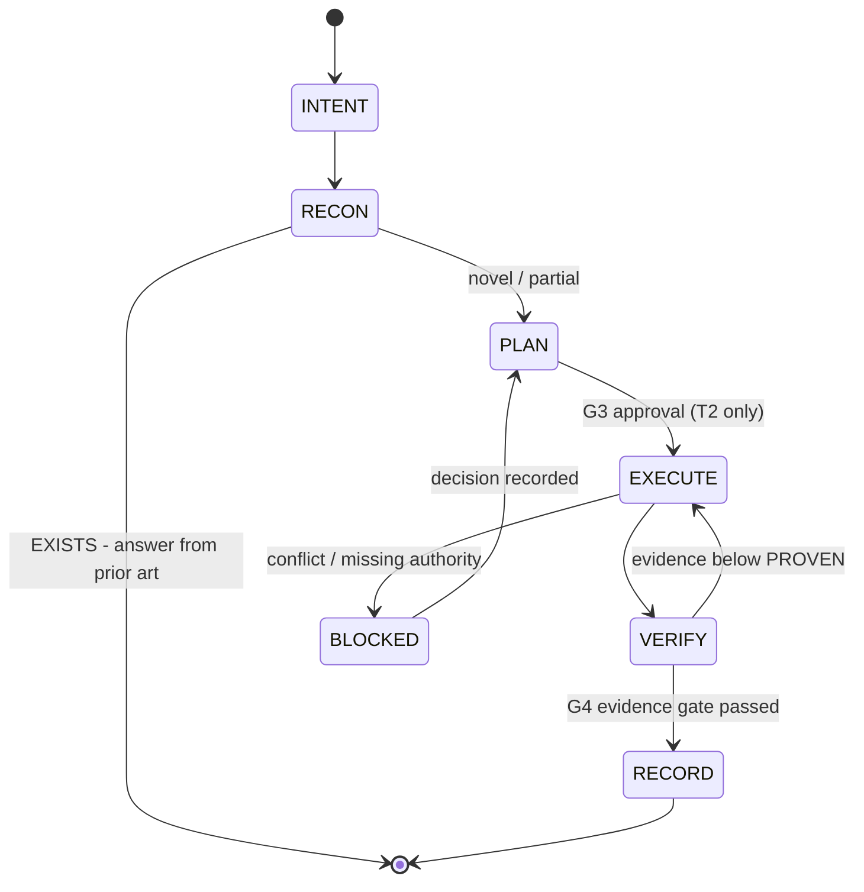

# ViewTube HERALD — Cross-Application AI Conversation System

**Status:** PLAN ONLY — no runtime wiring, no behaviour change.
**Date:** 2026-09-15
**Branch:** `claude/iewtuve-ai-system-aedxj4`
**Base:** `6bab2df` (main @ 2026-09-14)
**Scope:** How every ViewTube AI conversation — in Claude Code, Codex, Cursor, Gemini, Replit, the web app, CI — becomes informed, non-duplicative, chronological and interconnected.

> This document is written **in the response contract it proposes**, as a working example of the format.

---

## §1 READBACK — what you asked for

You want a system that makes every ViewTube-related AI conversation, in every application, maximally powerful, informed, conservative of effort, streamlined, interconnected and chronological — built from agents, prompts, workflows and response templates.

Decomposed into eleven testable requirements:

| # | Requirement | Herald component |
|---|---|---|
| R1 | My prompts become clear, descriptive, oriented | HERALD-IN (intake contract) |
| R2 | Every response restates what I actually want | §1 READBACK block |
| R3 | Every response checks whether it **already exists** across branches | RECON engine → §2 |
| R4 | Every response says whether there is a **better way** | §4 BETTER-PATH |
| R5 | Every response names **obstacles I don't know about** | §5 OBSTACLES |
| R6 | Every response names **prebuilt tools that make it easier** | §6 LEVERAGE-IN |
| R7 | Every response recommends **GitHub repos** worth adopting | §7 LEVERAGE-OUT |
| R8 | Every response gives **exact how-to** detail | §8 PLAN |
| R9 | Status/updates are precise about proven vs claimed | §9 STATUS |
| R10 | I get told useful things I did not ask about | §10 KNOW |
| R11 | Conversations are chronological and interconnected across apps | LEDGER |

**Assumptions I am making** (correct me and the plan changes):
- "All different applications" means the AI coding surfaces you use against this repo, plus the ViewTube app's own Brain — not a new end-user product.
- You want governance over *conversations about the repo*, not a replacement for the Brain runtime that ships to creators.
- Plan first, build second. Nothing here is implemented yet.

**Explicit non-goals:**
- No second sovereign. The Crown constitution already forbids "two competing supreme agents" (`docs/architecture/VIEWTUBE_CROWN_INTEGRATION_SYSTEM.md`). Herald is a **protocol layer**, not an authority.
- No second Task Index, memory store, analytics reader or deployment authority.
- No change to `src/` runtime behaviour in phases H0–H3.

---

## §2 PRIOR-ART — what already exists (do not rebuild)

This is the part most likely to save you months. **A large share of what you described is already built.**

| Asset | Location | Verdict |
|---|---|---|
| Two-sovereign constitution (KING/EMPEROR), conflict levels L0–L3 | `docs/architecture/VIEWTUBE_CROWN_INTEGRATION_SYSTEM.md` | **Exists — reuse as the constitution** |
| 7-stage lifecycle `DISCOVER→SYNTHESIZE→DECIDE→PLAN→EXECUTE→VERIFY→LEARN` | same | **Exists — Herald plugs into it** |
| 5 record types: `VT_MISSION`, `VT_WORK_ORDER`, `VT_RECEIPT`, `VT_DECISION`, `VT_ARTIFACT_RECORD` | same + `docs/architecture/viewtube-crown-protocols.schema.json` | **Exists — Herald emits these, invents none** |
| File-backed handoff bus (missions / work-orders / receipts / decisions / artifacts / handoffs / conflicts) | `.viewtube/exchange/` + `README.md` | **Exists — Phase B materially implemented** |
| Exchange validator | `scripts/validate-crown-exchange.mjs` | **Exists** |
| Chronology snapshot generator (git log + Task Index projection, read-only) | `scripts/generate-crown-today-snapshot.mjs` | **Exists — Herald LEDGER extends it** |
| Cross-record link reporter | `scripts/report-crown-links.mjs` | **Exists** |
| AI-ownership / anti-duplication governance, 17 canonical owners, eval rules | `.claude/skills/viewtube-ai-system-governor/SKILL.md` (152 lines) | **Exists — strongest asset in the repo** |
| Eval fixtures for the governor | `.claude/skills/viewtube-ai-system-governor/evals/evals.json` | **Exists — unwired** |
| 19 ViewTube skills (Crown, 5 Princes, arbiter, chancellor, finders, domain specialists) | `.claude/skills/` | **Exists** |
| Prior-art discipline (`skill-finder`, `solution-finder`, `docs-grill`) | `.claude/skills/viewtube-*-finder`, `-grill` | **Exists — but advisory only, not enforced** |
| External skill supply chain, 60 skills from 12 GitHub sources, hash-pinned | `skills-lock.json` | **Exists** |
| CI release gates (source-governance, focused-contracts, full-suite, static-quality, production-build, local-smoke) | `.github/workflows/release-gates.yml` | **Exists** |

**Conclusion:** Do **not** build a new agent framework. Herald is ~15% new code and ~85% enforcement, distribution and wiring of what you already own.

---

## §3 GAPS AND OBSTACLES — verified in this checkout

Each of these is confirmed by command, not inferred.

### O1 — `.gitignore` is deny-by-default and will silently swallow the system you are building ⚠️ **highest severity**

`.gitignore:2` is `/*`; `docs/*` is re-excluded at line 61; `.claude/` at line 84.

```
$ git check-ignore -v .claude/skills/new-skill/SKILL.md
.gitignore:84:.claude/    .claude/skills/new-skill/SKILL.md
$ git check-ignore -v docs/NEW_PLAN.md
.gitignore:61:docs/*      docs/NEW_PLAN.md
$ git check-ignore -v .viewtube/exchange/missions/new.json
.gitignore:2:/*           .viewtube/exchange/missions/new.json
```

The 31 tracked `.claude/` files and 79 tracked `docs/` files survive only because ignore rules do not apply to already-tracked files — they were force-added.

**Consequence for Herald:** an agent in *any* application that writes a new skill, a new mission record, or a new plan doc will have it **silently dropped at commit time**. The agent reports success; the file never leaves the machine. This single fact would quietly defeat "interconnected across applications."

**Fix (prescribed, Phase H0):** git cannot re-include a child whose parent directory is excluded — the repo's own comment at `.gitignore:59-60` says exactly this. So the rules must change shape, not just gain negations:

```gitignore
.claude/*                 # was: .claude/
!.claude/skills/
!.claude/skills/**
!/agent/
!/agent/**
!/AGENTS.md
!.viewtube/
!.viewtube/**
!docs/herald/
!docs/herald/**
```

### O2 — Cross-application skill mirrors have already fully drifted

```
viewtube-mobile-widget-system : DIFFERENT (103 diff lines)
viewtube-widget-dashboard     : DIFFERENT (115 diff lines)
```

Coverage today: **19** skills for Claude Code, **2** (divergent) for Codex, **0** for Cursor / Gemini / Copilot. There is no `AGENTS.md`. `skills/viewtube-toolbox-builder/` duplicates `.claude/skills/viewtube-toolbox-builder/` byte-for-byte (two copies, no generator), and `skills/viewtube-youtube-auth-api-stabilization/` exists **only** in `skills/` — Claude Code never loads it.

This is the concrete proof that "same rules in every application" is currently false.

### O3 — Prior-art recon is manual against 335 branches

`git ls-remote --heads origin` → **335** branches (134 `fix/`, 69 `feat/`, 24 `codex/`, 20 `refactor/`, 18 `docs/`, 11 `claude/`, …). No human or agent checks 335 branches before proposing work. This is precisely the duplication you are trying to stop, and it cannot be solved by instructions alone — it needs tooling.

### O4 — The clone is shallow and single-branch in agent sessions

```
$ test -f .git/shallow && echo SHALLOW   → SHALLOW
$ git for-each-ref refs/remotes/origin | wc -l   → 2
```

Only `main` and the working branch exist locally. **Any recon design that reads local refs will silently return "no prior art" and be wrong every time.** Recon must use `git ls-remote`, the GitHub API, and bounded `git fetch --depth=1 origin <branch>` on shortlisted candidates only.

### O5 — The canonical Task Index lives outside the repo ✅ **RESOLVED 2026-09-15 — see §13**

`scripts/generate-crown-today-snapshot.mjs` accepts `--task-index=<path>` and degrades to *"Supplied canonical Task Index path is unavailable in this checkout."* Chronology has no in-repo anchor. Needs a decision (see §9 D1).

### O6 — Two npm scripts point at files that do not exist

```
npm run generate:oracle-skill-pack     → scripts/generate-oracle-skill-pack.mjs   MISSING
npm run generate:analytics-sync-backlog → scripts/generate-analytics-sync-backlog.mjs MISSING
```

Both fail immediately. Any agent that trusts `package.json` as a capability inventory is working from a false map.

### O7 — Lint debt makes the quality gate uninformative

`CLAUDE.md` records ~1,800 pre-existing `lint:runtime` errors and that "admin-bypass on merges is the current norm." A gate that always fails teaches every agent and human to ignore it, so Herald must not add gates to that same pile — Herald checks must be **green on main from day one** (see §8 H0).

### O8 — Governance exists but is advisory

`skill-finder`, `solution-finder` and `docs-grill` encode exactly the "check before you build" discipline you want, but nothing *requires* them. Compliance is currently a function of whether a given model remembered to invoke a skill.

---

## §4 BETTER-PATH — why this shape and not the obvious one

**The obvious approach** — write a long master prompt telling every AI to always do the eleven things — fails for three reasons this repo already demonstrates:

1. **Instructions drift across applications.** O2 is the proof: two mirrored files, 103 and 115 lines divergent, with no generator to keep them honest.
2. **Instructions cannot see 335 branches.** R3 ("has this already been built?") is a *data* problem. No prompt makes a model aware of branch `fix/channel-progress-mobile-controller` from eight months ago. Recon must be a script that produces a dossier the model reads.
3. **Uniform verbosity is the waste you asked to eliminate.** Demanding eleven blocks for "fix this typo" burns tokens and trains you to skim — which destroys the blocks that matter.

**Therefore:** a **generated, tiered, tool-backed contract**.

- **Generated** — one source directory, N application targets, drift fails CI (kills O2).
- **Tool-backed** — RECON and LEDGER are scripts producing structured dossiers; the model consumes facts instead of recalling them (kills O3/O4).
- **Tiered** — T0/T1/T2 response depth by task size (serves "conservative and waste-less").

**Rejected alternatives:**
- *A new orchestration framework (LangGraph/CrewAI/OpenHands).* Rejected: Crown already defines the lifecycle and record types; a framework would create the second sovereign the constitution forbids.
- *A temporal knowledge graph (Graphiti) as the chronology store, now.* Rejected for H0–H3: requires Neo4j/FalkorDB and an embedding pipeline. Append-only JSONL gives 90% of the value at ~0 infrastructure. Revisit at H5 (§7).
- *Enforcing the contract via a model-graded CI check.* Rejected initially: non-deterministic gates on top of O7's always-red gate would be ignored. Start with deterministic schema checks.

---

## §5 THE HERALD DESIGN

### 5.1 Constitutional position

```
CREATOR  (final authority — unchanged)
   │
   ├── KING     — desired state   (missions, plans, acceptance)
   ├── EMPEROR  — executable state (work orders, code, receipts)
   │
   └── HERALD   — the voice, not a sovereign
                  · shapes what goes IN to a conversation
                  · shapes what comes OUT of a conversation
                  · records the conversation chronologically
                  · carries the same rules into every application
```

A herald announces and carries messages between courts; it never rules. Herald **owns no paths in `src/`**, decides nothing, and can be deleted without changing runtime behaviour. That is deliberate: it keeps the constitution's "no second supreme agent" rule intact.

### 5.2 HERALD-IN — the prompt intake contract (R1)

Your raw intent is enough; Herald's job is to convert it, visibly, into a structured brief you can correct in one line. The agent restates in this shape **before** doing work:

```
INTENT     one sentence, outcome not method
SURFACE    which app/page/service/skill is affected
TIER       T0 micro | T1 standard | T2 mission
EVIDENCE   what must be true for this to be "done"
NON-GOALS  what I will deliberately not touch
UNKNOWNS   what I will assume unless you say otherwise
```

Two supporting pieces:

- **`/vt` slash command** (Claude Code) / equivalent prompt prefix elsewhere — expands a one-line ask into the brief above and runs RECON before answering.
- **Intent vocabulary** — a fixed verb set so intent is unambiguous across apps: `AUDIT · RECON · PLAN · BUILD · FIX · VERIFY · DOCUMENT · DECIDE · RECOVER`. Each verb maps to a default tier and a required output set.

You never have to write a good prompt. You write what you want; Herald writes the good prompt and shows it to you.

### 5.3 HERALD-OUT — the response contract (R2–R10)

> **Canonical text now lives in `agent/contracts/herald-out.md`.** It has since grown to
> twelve blocks — a REFERENCES block was inserted at §7, shifting the later numbers. The
> table below is the original rationale and is deliberately not kept in sync; read the
> contract file for current truth.

Eleven blocks, tiered so small work stays small.

| § | Block | T0 | T1 | T2 | Answers |
|---|---|:--:|:--:|:--:|---|
| 1 | **READBACK** — restated intent, assumptions, non-goals | ● | ● | ● | R2 |
| 2 | **PRIOR-ART** — already built? branches/PRs/docs/quarantine searched, verdict | | ● | ● | R3 |
| 3 | **OWNER** — canonical owner of every path to be touched | | ● | ● | anti-duplication |
| 4 | **BETTER-PATH** — simpler route considered and why rejected | | | ● | R4 |
| 5 | **OBSTACLES** — verified blockers, incl. repo traps | | ● | ● | R5 |
| 6 | **LEVERAGE-IN** — existing repo scripts/skills/components to reuse | | ● | ● | R6 |
| 7 | **LEVERAGE-OUT** — external repos/packages, with verification status | | | ● | R7 |
| 8 | **PLAN** — ordered steps, exact paths, commands, tests | ● | ● | ● | R8 |
| 9 | **STATUS** — `complete/partial/blocked`, changed paths, **proven vs claimed** | ● | ● | ● | R9 |
| 10 | **KNOW** — useful things you did not ask about | | ● | ● | R10 |
| 11 | **LEDGER** — chronology id + links to prior related turns | | | ● | R11 |

**Tier selection is mechanical, not discretionary:**
- **T0** — no `src/` change, ≤1 file, reversible in one command. (typo, copy, comment)
- **T1** — default. Any `src/`/`server/`/`api/` change, or any new file.
- **T2** — crosses two or more canonical owners, adds a subsystem, changes a schema/contract, or touches auth/billing/publishing/OAuth.

**The §9 STATUS block carries the repo's hardest-won rule** (`VIEWTUBE_CROWN_INTEGRATION_SYSTEM.md`): *plans are not code; code is not integration; integration is not verified runtime; preview is not production.* Every status must separate:

```
PROVEN    <what a command actually demonstrated, with the command>
CLAIMED   <what I believe but did not run>
UNKNOWN   <what remains unverified and why>
```

This is the single highest-value block. It is what turns "status descriptions" into something you can trust.

### 5.4 RECON — the prior-art engine (R3, R6)

`scripts/herald-recon.mjs --topic "<keywords>" [--depth quick|full]`

Pipeline, ordered cheapest-first:

1. **Local semantic sweep** — `docs/`, `docs/architecture/`, `governance/`, `_quarantine/`, `.viewtube/exchange/`, `src/` for existing components and functions.
2. **Branch sweep** — `git ls-remote --heads origin` (not local refs — see O4), fuzzy-match the 335 branch names, rank by recency and token overlap.
3. **Shortlist inspection** — `git fetch --depth=1 origin <branch>` for the top N (default 5) only; diff their touched paths against the proposed paths.
4. **Forge sweep** — GitHub API for PRs/issues matching the topic, including **closed and unmerged** ones (a closed PR is often the record of *why* an approach failed).
5. **Skill sweep** — the 19 local skills plus the 60 in `skills-lock.json`.
6. **Emit** — `.viewtube/herald/recon/<slug>.json` + a markdown digest, with a verdict:
   `NOVEL` · `PARTIAL (n prior attempts)` · `EXISTS (see <ref>)` · `FAILED-BEFORE (see <ref>)`

**Cache:** keyed on topic + `origin/main` SHA, TTL 24h, so repeated asks cost nothing. This is the waste-elimination mechanism.

`FAILED-BEFORE` is the highest-value verdict the engine can return, and no prompt-only system can produce it.

### 5.5 LEDGER — chronology across applications (R11)

Append-only JSONL, one line per conversational turn that changed something:

```
.viewtube/herald/ledger/2026-09-15.jsonl
{"ts":"2026-09-15T14:02:11Z","app":"claude-code","session":"...","tier":"T2",
 "missionId":"VT-MISSION-...","intent":"...","verb":"PLAN",
 "changedPaths":["docs/..."],"status":"complete",
 "recon":"herald/recon/<slug>.json","prev":"<ledger id>","next":"..."}
```

Properties that deliver "interconnected and chronological":
- **Any application can append** — it is a file write, not an API. Codex, Cursor, a CI job and the web app all use the same line format.
- **`prev`/`next` form conversation chains** across applications and across days.
- **`missionId` joins Herald turns to existing Crown records** in `.viewtube/exchange/` — one spine, not a parallel history.
- **Read side reuses what exists** — extend `scripts/generate-crown-today-snapshot.mjs`, which already builds a read-only git-log projection, rather than writing a second reader.

`scripts/herald-ledger.mjs --since 7d --topic brain` renders the chronology for a topic across every application.

Deliberately **not** a memory store. The governor forbids parallel memory authorities; the ledger records *what conversations happened*, never durable creator knowledge.

### 5.6 DISTRIBUTOR — one source, every application (fixes O2)

```
agent/                          ← single source of truth (tracked)
├── contracts/
│   ├── herald-in.md            intake contract
│   ├── herald-out.md           response contract + tier table
│   └── status-vocabulary.md    proven / claimed / unknown
├── skills/                     canonical ViewTube skills (the 19, deduped)
└── targets.json                which target gets which subset

        │  node scripts/herald-sync.mjs
        ▼
AGENTS.md                       cross-agent standard (root)
.claude/skills/**               Claude Code
.codex/skills/**                Codex
.cursor/rules/*.mdc             Cursor
GEMINI.md                       Gemini
.github/copilot-instructions.md Copilot
```

- `herald-sync.mjs --check` fails on any drift → wired into `release-gates.yml` as a **new, always-green** job (not added to the red `static-quality` pile, per O7).
- Resolves the `skills/` ↔ `.claude/skills/` byte-identical duplication and surfaces `viewtube-youtube-auth-api-stabilization`, currently loaded by nothing.
- **`AGENTS.md` is the keystone for "all different applications"** — it is the cross-tool open standard (adopted by 20k+ repositories, formalised Aug 2025 by OpenAI, Google, Cursor, Factory and Sourcegraph), so one generated file covers tools Herald has no explicit target for.

### 5.7 BUDGET — the conservative / waste-less layer

Encoded as hard rules in `herald-out.md`:

1. **Deterministic before model.** If a script can answer it, run the script. (Already governor doctrine; Herald enforces it at conversation level.)
2. **Recon cache before recon.** Never re-scan 335 branches inside a TTL.
3. **Tier honestly.** T2 blocks on a T0 task is waste, not thoroughness.
4. **Just-in-time context.** No full-file dumps where a `sed -n` range answers it; no raw analytics in prompts.
5. **One writer per path.** Existing Crown rule — prevents the most expensive waste of all, two agents editing one file.
6. **Cite, don't restate.** Link `docs/architecture/...`; never paste it into the conversation.

---

## §6 AGENT ROSTER — reuse first, add four

**Reused unchanged (19):** Crown, the five Princes (Observatory, Citadel, Brain, Forge, Compass), conflict-arbiter, verification-chancellor, king-emperor-bridge, task-artifact-bridge, docs-grill, skill-finder, solution-finder, skill-authoring, ai-system-governor, widget-dashboard, mobile-widget-system, toolbox-builder, youtube-api-expert.

**New (4) — deliberately minimal:**

| Agent | Role | Why it cannot be an existing skill |
|---|---|---|
| `viewtube-herald-intake` | Converts raw intent → HERALD-IN brief; assigns tier and verb | No existing skill shapes *input*; all 19 shape output |
| `viewtube-herald-recon` | Runs and interprets the recon dossier; issues the verdict | `solution-finder` reasons over what it is told; nothing gathers across 335 branches |
| `viewtube-herald-scribe` | Writes the LEDGER entry; maintains `prev`/`next` chains | `task-artifact-bridge` is read-only by charter and must stay that way |
| `viewtube-herald-auditor` | Scores a response against the tier's required blocks | Enforcement role; no existing skill audits conversations |

Four new agents against nineteen reused is the ratio the `skill-finder` discipline demands.

---

## §7 LEVERAGE-OUT — external repositories worth adopting

Verified by web search on 2026-09-15. **Adopt none blindly** — §8 H1 includes a supply-chain review step, and the `pr-agent` entry below shows why.

| Repo | What it gives Herald | Fit | Caution |
|---|---|---|---|
| [`agentsmd/agents.md`](https://github.com/agentsmd/agents.md) · [agents.md](https://agents.md/) | The cross-agent instruction standard; 20k+ repos; nearest-file-wins precedence | **Adopt — H1.** The DISTRIBUTOR's primary output format | Format only, no runtime |
| [`github/spec-kit`](https://github.com/github/spec-kit) | Spec-Driven Development templates and workflow; multi-assistant | **Mine for HERALD-IN — H1.** Its spec templates are a proven intake shape | Full SDD adoption would collide with Crown's lifecycle; take the templates, not the methodology |
| [`github/gh-aw`](https://github.com/github/gh-aw) (GitHub Agentic Workflows) | Agentic automation defined in Markdown + YAML frontmatter, compiled to Actions; built for triage, PR review, CI-failure investigation | **Strong — H4.** The natural host for automated RECON on PR open | Technical preview; verify status before depending on it |
| [`promptfoo/promptfoo`](https://github.com/promptfoo/promptfoo) + [`promptfoo-action`](https://github.com/promptfoo/promptfoo-action) | Declarative prompt/agent eval with CI integration | **High — H3.** `viewtube-ai-system-governor/evals/evals.json` already exists and is unwired; this wires it | Now under OpenAI stewardship; MIT, still open source |
| [`humanlayer/humanlayer`](https://github.com/humanlayer/humanlayer) | Deterministic human-approval gates on high-stakes tool calls | **Conceptual now, real at H5.** Directly implements "Creator remains final authority" and the governor's approval-gate rule | Adds a service dependency; the file-backed `VT_DECISION` record may be sufficient |
| [`getzep/graphiti`](https://github.com/getzep/graphiti) | Temporal knowledge graph with provenance and fact-change-over-time; MCP server included | **H5 upgrade path for LEDGER.** Its temporal model matches "chronological" exactly | Needs Neo4j/FalkorDB + embeddings. Do **not** start here — JSONL first |
| [`anthropics/skills`](https://github.com/anthropics/skills) · [`anthropics/claude-plugins-official`](https://github.com/anthropics/claude-plugins-official) | Reference patterns for skill structure and packaging | **Reference — H1.** Validate the 19 skills against official shape | — |
| [`hesreallyhim/awesome-claude-code`](https://github.com/hesreallyhim/awesome-claude-code) | Catalog; notably **greplica** (indexes repo + session transcripts as persistent memory) and **engram** (turns past sessions into reusable guidance) | **Evaluate at H4** — both overlap LEDGER; one may replace part of it | Community catalog; quality varies per entry |
| [`Jamie-BitFlight/claude_skills`](https://github.com/Jamie-BitFlight/claude_skills) | Prior art for one skill source targeting Claude Code, Codex **and** Cursor | **Study before writing `herald-sync.mjs` — H1** | Verify maintenance before depending on it |
| [`systempromptio/awesome-ai-agent-governance`](https://github.com/systempromptio/awesome-ai-agent-governance) | Policy enforcement, audit trails, MCP/Claude Code security | **Reference — H2** for the audit-trail design | Curated list, not a library |
| [`TensorBlock/awesome-mcp-servers`](https://github.com/TensorBlock/awesome-mcp-servers) | Knowledge-management / memory MCP server index | **Reference — H5** | — |
| [`qodo-ai/pr-agent`](https://github.com/qodo-ai/pr-agent) → now [`The-PR-Agent/pr-agent`](https://github.com/The-PR-Agent/pr-agent) | Automated PR analysis and review | **Defer.** Overlaps the Claude Code Review already on this repo | ⚠️ Ownership and naming have churned (Codium → Qodo → community). Exactly the case for verifying before adopting |

---

## §8 PLAN — phased implementation

Each phase is independently mergeable, PR-to-`main`, and reversible. Phases H0–H2 touch no `src/`.

### H0 — Unblock the plumbing *(½ day, prerequisite for everything)*

1. Fix `.gitignore` per O1 so new agent/doc/exchange files are trackable without `git add -f`.
2. Verify with the three `git check-ignore` commands from O1 — all must return not-ignored.
3. Repair or remove the two dead npm scripts (O6).
4. Document in `CLAUDE.md` that `.gitignore` is deny-by-default and which trees are allow-listed.

**Gate:** `git check-ignore` clean on all target paths; `npm run` inventory has no dead entries.

### H1 — Contracts and distribution *(2–3 days, delivers R1, R2, R8, and fixes O2)*

1. Create `agent/contracts/{herald-in,herald-out,status-vocabulary}.md`.
2. Move the 19 skills to `agent/skills/`; dedupe `skills/viewtube-toolbox-builder`; adopt the orphaned `viewtube-youtube-auth-api-stabilization`.
3. Write `scripts/herald-sync.mjs` (generate + `--check`), studying `Jamie-BitFlight/claude_skills` first.
4. Generate `AGENTS.md`, `.claude/skills/**`, `.codex/skills/**`, `.cursor/rules/*.mdc`, `GEMINI.md`, `.github/copilot-instructions.md`.
5. Add a **new** `herald-drift` job to `release-gates.yml` — must be green on `main` at merge (O7).

**Gate:** `node scripts/herald-sync.mjs --check` exits 0; Codex and Claude skill trees byte-identical where shared.

### H2 — RECON and LEDGER *(3–5 days, delivers R3, R6, R11)*

1. `scripts/herald-recon.mjs` — the six-stage pipeline in §5.4. **Must use `git ls-remote`, never local refs** (O4).
2. `scripts/herald-ledger.mjs` — append + render.
3. Extend `generate-crown-today-snapshot.mjs` to fold ledger entries into the chronology.
4. Seed the recon cache against ten known-duplicated topics and measure.

**Gate:** recon on a topic with known prior art (e.g. `channel-progress-mobile-controller`) returns `EXISTS` with the correct branch; full run under 60s warm.

### H3 — Enforcement and evals *(2–3 days, delivers R9)*

1. `viewtube-herald-auditor` skill + `scripts/herald-audit.mjs` — deterministic block-presence check against tier.
2. Wire `promptfoo` over the existing `viewtube-ai-system-governor/evals/evals.json`.
3. Add response-contract cases: does the model produce §2 PRIOR-ART when prior art exists? Does §9 correctly separate proven from claimed?

**Gate:** eval suite runs in CI; baseline recorded; no regression gate until baseline is stable.

### H4 — Automation *(3–5 days)*

1. `gh-aw` workflow: run RECON automatically on PR open, post the dossier as a PR comment.
2. Evaluate **greplica** / **engram** against LEDGER; absorb or reject with a written `VT_DECISION`.

### H5 — Optional depth *(revisit only if H2 proves insufficient)*

Graphiti-backed temporal ledger; HumanLayer approval gates. Both add infrastructure — only justified by measured pain.

---

## §9 STATUS

```
STATUS    complete  (planning deliverable)

PROVEN    · 19 Claude skills, 2 Codex skills, 0 Cursor/Gemini/Copilot  [ls, diff]
          · Codex mirrors drifted 103 and 115 diff lines               [diff]
          · 335 remote branches                                        [git ls-remote | wc -l]
          · clone is shallow; only 2 local remote refs                 [.git/shallow, for-each-ref]
          · new files under .claude/, docs/, .viewtube/ are ignored    [git check-ignore -v]
          · 2 npm scripts reference missing files                      [ls]
          · 60 external skills hash-pinned from 12 sources             [skills-lock.json]
          · Crown lifecycle, 5 record types, exchange bus, validator   [read]
          · all 12 recommended repos exist at the URLs given           [web search 2026-09-15]

CLAIMED   · effort estimates in §8 (judgement, not measurement)
          · that H2's JSONL ledger suffices before H5's graph
          · that the tier table matches how you actually work

UNKNOWN   · which applications beyond Claude Code and Codex you use in practice
          · whether `gh-aw` has left technical preview

CHANGED   docs/VIEWTUBE_HERALD_CROSS_APP_AI_CONVERSATION_SYSTEM_PLAN_2026-09-15.md  (new)
```

---

## §10 KNOW — things you did not ask about

1. **`.gitignore` (O1) is the finding that matters most today.** It is not a Herald problem — it affects every session right now. Work that agents believe they saved may not be in the repository. Worth an independent check of recent sessions.
2. **You already own the hardest part.** `viewtube-ai-system-governor` (152 lines, 17 canonical owners, anti-duplication checks, eval rules) is more rigorous than most production AI governance. The gap is distribution and enforcement, not doctrine.
3. **`evals/evals.json` exists and nothing runs it.** Fastest credibility win in the plan — H3, roughly a day.
4. **335 branches is itself a standing risk.** Independent of Herald, a branch-triage pass using the `git cherry origin/main <branch>` recipe already in `CLAUDE.md` would shrink recon's search space and reduce cost permanently.
5. **`skills-lock.json` is an unreviewed supply chain.** 60 skills from 12 third-party GitHub accounts execute as instructions in your sessions. They are hash-pinned (good), but never reviewed. Worth one audit pass.
6. **The lint debt (O7) is quietly training everyone to ignore CI.** Every new gate inherits that credibility problem. This is why Herald's gates must be green from day one — and why the debt deserves its own PR sooner than it looks.
7. **`_quarantine/` holds `brain-legacy` and `performance-workflow`.** RECON must search it; "we already tried that and quarantined it" is a real and frequent answer.

---

## §11 OPEN DECISIONS

| # | Decision | Options | Recommendation |
|---|---|---|---|
| D1 | ~~Where does the canonical Task Index live?~~ **RESOLVED** — `/Users/cwb/Downloads/viewtube/ViewTube-Task-Index.html`, schema 15, 1,598 tasks. See §13 | — | Superseded by D5–D7 below |
| D2 | Which applications are in scope? | Claude Code + Codex only / + Cursor + Gemini / + Copilot + Replit | `AGENTS.md` covers unknown tools at near-zero cost — generate it regardless |
| D3 | Contract enforcement strength | advisory / deterministic block check / model-graded | **deterministic first** (H3); model-graded only after O7 is resolved |
| D4 | Do H0 as part of this work or as its own PR? | bundled / separate | **separate, first** — it is a repo-wide correctness fix, valuable even if Herald is never built |
| D5 | How does the Task Index become writable by agents? (O9/O10) | keep browser-only / JSON sidecar in repo / full migration to repo | **JSON sidecar** — the HTML already round-trips via `encodeState()`/`applyImported()`; see §13.4 |
| D6 | Which of the two uploaded reference docs is authoritative? (O12) | memory reference / Task Index backend reference | **Task Index backend reference** — it names `themotionvisual/ViewTubeBUILD`; the memory doc's `viewtubeX` paths are stale |
| D7 | Reconcile status vocabularies now or at H3? (O11) | now / H3 | **now** — it is a half-page mapping (§13.3) and every later phase depends on it |

---

## §12 NEXT ACTION

Approve the shape, then **H0 as a standalone PR** — it is small, independently valuable, and every later phase depends on it.

**Verification recipe for this document:**

```bash
git ls-remote --heads origin | wc -l                       # 335
diff .codex/skills/viewtube-widget-dashboard/SKILL.md \
     .claude/skills/viewtube-widget-dashboard/SKILL.md | wc -l   # 115
git check-ignore -v .claude/skills/new-skill/SKILL.md      # ignored
ls scripts/generate-oracle-skill-pack.mjs                  # missing
test -f .git/shallow && echo SHALLOW                       # SHALLOW
```

---

# §13 ADDENDUM — Task Index reconciliation (2026-09-15)

Three sources were supplied after the plan was drafted: the `viewtube-task-index-ai-efficient-manager` skill, the condensed memory reference, and `ViewTube-Task-Index5.html` (schema 15, 563 KB). They resolve **O5/D1** and change the plan materially.

## 13.1 What the Task Index actually is

| Property | Value | Source |
|---|---|---|
| Canonical path | `/Users/cwb/Downloads/viewtube/ViewTube-Task-Index.html` | `AI_BACKEND_REFERENCE.locations` |
| **Project repo** | **`themotionvisual/ViewTubeBUILD`** | same — **this repo is confirmed canonical** |
| Schema | 15 (`CANONICAL_SCHEMA_VERSION`) | HTML |
| Tasks | **1,598** across **35 modules** | `"id":` / `"moduleId":` counts |
| Seeded status | 1,003 Not Started · 415 Started · 52 Nearly Finished · 43 Finished · 85 Urgent | `initialStatus` distribution |
| Statuses 5–7 in use | **none** — Needs Clarification, Deferred, Needs Debugging all zero | same |
| Quick Wins | 64 of 1,598 | `defaultQuickWin` |
| Legacy reconciliation | 228 aliases merged from the retired ViewTubeX ledger, 2026-08-28 | `mergeLog` |
| Known comparison branches | **3** (`viewtube-live-deployment`, `branch-check`, `fix/progress-visual-time-windows`) | `locations` |

It is a genuinely sophisticated instrument: hidden `AI_BACKEND_REFERENCE`, an editable embedded skill, a debug-log channel, a session change log, and an `encodeState()`/`applyImported()` JSON round-trip.

**This is major prior art for Herald.** Its golden rule — *"Spend AI context once, save the useful conclusion and exact pointer, and make the next agent start from that cache"* — is Herald's LEDGER and RECON cache, already specified. §2 PRIOR-ART missed it only because the file is not in the repository.

## 13.2 New obstacles — the cache was designed well and is empty

### O9 — The AI continuity cache holds almost no evidence ⚠️ **this is the decisive finding**

```
taskRefs entries                     230   (14.4% of 1,598 tasks)
  ├─ legacyLedgerCodes/Marker/Source 228   ← one-time migration breadcrumbs, 2026-08-28
  └─ real evidence (paths+evidence)    2   ← 0.13% of tasks
prescribed shape coverage: paths 2 · branches 0 · artifacts 0 · evidence 2 · remaining 0 · lastChecked 0
aiDebugLog entries                     0
tasks at status 7 (Needs Debugging)    0
```

The skill devotes an entire section to the DEBUG LOG mechanism. **It has never been used once.** 228 of the 230 cache entries are migration residue from a single day; only two carry the `{paths, branches, artifacts, evidence, remaining, lastChecked}` shape the skill prescribes.

**Why this matters more than any other finding in this document:** the exact system you are asking me to build has already been designed, correctly, and it did not get written to. Not because the design was wrong — the design is good — but because **the write path is a manual browser action**: open the HTML, click a badge, type, click Save Changes, drive a native save dialog. An agent in Claude Code or Codex cannot do that. So "cache expensive discoveries immediately" stayed an instruction and never became a behaviour.

**The lesson Herald must absorb:** *a continuity cache that requires a human gesture will be empty.* Herald's ledger and recon cache must be **plain file appends an agent performs as part of finishing a turn** — or Herald will reproduce this outcome exactly.

### O10 — The Task Index has never been saved, and all live state is in one browser

```
<script id="vt-embedded-snapshot">{"v":15,"savedAt":null}</script>
```

`savedAt` is `null`: the self-contained save has never run. Every status change, badge, note and code snippet you have made lives only in `localStorage` on one browser on one machine.

**Consequences:** clearing site data loses all task progress; no agent in any application can read current status; the seeded 43-Finished figure is the 2026-08-28 baseline, not today's truth; and the "saved HTML is the preferred handoff artifact" workflow described in the skill has never actually executed.

This is the single highest-severity item in this document — above even O1 — because it is unrecoverable rather than merely inconvenient.

### O11 — Four status vocabularies now coexist

Task Index 8-state · Crown `complete/partial/blocked` · Herald `PROVEN/CLAIMED/UNKNOWN` · Herald `T0/T1/T2`. Resolved in §13.3 — they turn out to be orthogonal axes, not rivals.

### O12 — The two uploaded reference documents contradict each other

| Claim | Memory reference | Task Index backend reference | Reality |
|---|---|---|---|
| Active repo | `/Users/cwb/Downloads/viewtube/viewtubeX` | `themotionvisual/ViewTubeBUILD` | **ViewTubeBUILD** |
| Repo skills | `docs/skills/<skill>/SKILL.md` | — | `.claude/skills/` + `skills/` — `docs/skills/` does not exist here |
| Installed skills | `/Users/cwb/.codex/skills/` | — | `.codex/skills/` holds 2 drifted mirrors |

The memory reference is stale. It is still valuable — its **FAILURE → FIX INDEX** is the best artifact in either file — but its paths must not be trusted. Notably that index already contains *"Canonical docs missing from Git → verify tracked path/ignore rules; deliberately force-add only when appropriate"* — **you have already been bitten by O1 and recorded the fix**, which is strong independent confirmation.

### O13 — Branch knowledge covers 3 of 335

`knownComparisonBranches` lists three. RECON (§5.4) is the fix.

## 13.3 Reconciling the four vocabularies

They measure different things. Keep all four; define the mapping once.

| Axis | Vocabulary | Authority | Scope |
|---|---|---|---|
| **Task lifecycle** | 8-state (Not Started → Needs Debugging) | **Task Index — sole authority** | durable, per `vt-####` |
| **Mission outcome** | `complete / partial / blocked` | Crown | per mission record |
| **Evidence quality** | `PROVEN / CLAIMED / UNKNOWN` | Herald §9 | per response |
| **Response depth** | `T0 / T1 / T2` | Herald | per turn |

**Binding rules:**
- Adopt the Task Index's 9-level `sourcePriority` verbatim as Herald's evidence ladder — do not invent a tenth. Map: **PROVEN** = levels 1–3 (runtime/test, canonical main code, git history); **CLAIMED** = 4–7 (user correction, task index, active branch, artifact); **UNKNOWN** = 8–9 (conversation, memory/inference).
- **A task may not move to Finished on CLAIMED evidence.** This makes the existing rule *"never infer completion from a plan or a passing build alone"* mechanically checkable.
- `Nearly Finished` ⇔ mission `partial`. `Needs Debugging` ⇔ mission `blocked`.
- Herald **never writes task status**. `viewtube-herald-scribe` proposes; the Task Authority role disposes. This preserves "never create a second task/status ledger."

## 13.4 Plan changes

### New phase H0.5 — Rescue the Task Index *(1 day, now the highest-priority phase)*

Runs **before** H1. Ordered by severity:

1. **Export current live state today.** Open the Task Index, use the existing export, commit the JSON to `docs/herald/task-index/state-2026-09-15.json`. This removes the O10 total-loss risk in about five minutes and is worth doing before reading the rest of this plan.
2. **Commit the HTML itself** to `docs/herald/task-index/` (needs the H0 `.gitignore` fix first — allow-list `docs/herald/**`).
3. **Add `scripts/task-index.mjs`** with `read`, `set-status`, `add-ref`, `append-debug`, `export`, `import` subcommands operating on the JSON sidecar. The HTML already implements the `encodeState()`/`applyImported()` round-trip at schema 15, so this is a small adapter, **not new architecture**.
4. **Wire `generate-crown-today-snapshot.mjs --task-index=`** to the committed sidecar. Its documented degradation path — *"Supplied canonical Task Index path is unavailable in this checkout"* — then stops firing.

**Gate:** an agent in a fresh clone can read a task's status and append a debug entry with no browser involved.

### Changes to existing phases

- **H1** — add `agent/skills/viewtube-task-index-ai-efficient-manager/` (the uploaded skill, currently loaded by nothing in this repo) and `agent/reference/failure-fix-index.md` (extracted from the memory reference, paths corrected per O12) to the distribution source.
- **H2 RECON** — must read the Task Index sidecar as a first-class source. With 1,598 tasks and 335 branches, "has this already been built?" is most often answerable from the ledger alone, at near-zero cost. Seed `knownComparisonBranches` from RECON output (O13).
- **H2 LEDGER** — re-scoped. **Herald's ledger is conversation chronology, keyed by `vt-####`; it is not a task ledger.** Every entry gains a `taskIds: []` field joining it to the Task Index. The write path is an unconditional file append at turn end — per O9, this is the whole design.
- **H4** — evaluate the `ViewTube-Kingdom-Pack` (recorded in the memory reference as *"30 portable skills + workflows/mirrors validated offline"*) before writing `herald-sync.mjs`. That is prior art for the DISTRIBUTOR, and it may already be most of it.

### Revised phase order

```
H0    .gitignore fix                    ½ day   prerequisite
H0.5  Rescue the Task Index             1 day   ← highest severity (O10 is unrecoverable)
H1    Contracts + distribution          2–3 d
H2    RECON + LEDGER                    3–5 d
H3    Enforcement + evals               2–3 d
H4    Automation                        3–5 d
H5    Optional depth                    —
```

## 13.5 Status of this addendum

```
PROVEN    · projectRepo = themotionvisual/ViewTubeBUILD        [AI_BACKEND_REFERENCE.locations]
          · 1,598 tasks / 35 modules / schema 15               [key counts]
          · seeded status split 1003/415/52/43/85; 5–7 unused  [initialStatus distribution]
          · taskRefs 230, of which 228 legacy, 2 real evidence [key-frequency scan]
          · aiDebugLog empty                                   [parsed JSON]
          · savedAt = null — never saved                       [vt-embedded-snapshot tag]
          · knownComparisonBranches = 3 of 335                 [parsed JSON]
          · memory reference paths contradict backend ref      [both files vs this checkout]

CLAIMED   · that localStorage still holds richer live state than the seed
            (likely, but unverifiable from here — only your browser can confirm)
          · H0.5 effort estimate

UNKNOWN   · current true status of the 1,598 tasks
          · whether ViewTube-Kingdom-Pack still exists at the recorded path
```

## 13.6 The one thing to do first

**Export the Task Index state and commit it.** Everything else in this plan can wait a week. `savedAt: null` against 1,598 tasks held in a single browser profile is an unrecoverable-loss risk that costs five minutes to retire.

---

# §14 THE CONVERSATION WORKFLOW SYSTEM

§5 defined the contracts and components. This section defines the **runtime**: what actually happens, in order, in every conversation — and how one conversation continues in a different application a week later.

Three nested loops:

- **14.1 Turn loop** — the inner cycle, every single turn.
- **14.2 Thread loop** — the outer cycle, intent → verified outcome, spanning apps and days.
- **14.3 Named workflows** — the nine verbs, each with required stages and an exit gate.

## 14.1 The turn loop — seven steps, every turn, every application

```
┌─ 1 ORIENT ──── read thread file + ledger tail + task refs        (cheap, cached)
│  2 INTAKE ──── raw ask → HERALD-IN brief; assign verb + tier
│  3 RECON ───── prior-art check, cache-first                      (skippable: §14.4)
│  4 ROUTE ───── canonical owner + smallest skill set + writer lock
│  5 ACT ─────── do the work
│  6 REPORT ──── emit the tier's required blocks
└─ 7 RECORD ──── append ledger · update task refs · release lock   (UNCONDITIONAL)
```

**Steps 1 and 7 are the system.** Everything else is ordinary agent work that any competent model already does. O9 proved that the cache which is written "when it seems worth it" is empty after a year — so step 7 is not a recommendation, it is the definition of a completed turn. A turn that produced output but wrote no ledger line **did not happen**, and the next turn's step 1 will not see it.

Step 1 is what makes this cheap. It reads a bounded thread file, not a transcript: typically under 2 KB against a conversation that may have cost 200 KB to produce. That is the "spend AI context once" rule applied to conversations rather than to tasks.

## 14.2 The thread loop — a conversation as a durable state machine

A **thread** is one intent pursued to a verified outcome. It survives across applications, sessions and days.



This is Crown's seven-stage lifecycle with the gates made explicit and the `EXISTS` short-circuit added — the branch that stops duplicated work before it starts.

### The thread file

```
.viewtube/herald/threads/<threadId>.json
{
  "threadId": "th-2026-09-16-brain-evidence",
  "verb": "BUILD", "tier": "T2", "stage": "EXECUTE",
  "taskIds": ["vt-2841", "vt-2842"],
  "missionId": "VT-MISSION-BRAIN-evidence-tool-connection",
  "owner": "Brain Runtime",
  "writerLock": { "paths": ["src/services/brain/**"], "app": "claude-code", "ts": "..." },
  "reconRef": ".viewtube/herald/recon/brain-evidence.json",
  "openQuestions": ["does analytics-canon expose per-window grain?"],
  "nextAction": "wire evidence refs into ToolContextPack, then focused tests",
  "entries": ["led-0412", "led-0417", "led-0431"],
  "lastApp": "codex", "lastTs": "2026-09-16T11:04:02Z"
}
```

**Resuming a thread in a different application is reading this file.** Not re-reading a transcript, not re-running recon, not re-deriving the owner. That single property is what "interconnected and chronological across applications" actually means in practice.

### The five gates

| Gate | Blocks | Rule | Enforced by |
|---|---|---|---|
| **G1 Prior-art** | `RECON → PLAN` | No plan without a recon verdict | `herald-audit.mjs` |
| **G2 Owner** | `PLAN → EXECUTE` | Canonical owner named; writer lock acquired | lock file |
| **G3 Approval** | `PLAN → EXECUTE` | T2 requires explicit creator approval | human |
| **G4 Evidence** | `VERIFY → RECORD` | `complete` requires PROVEN (`sourcePriority` 1–3) | `herald-audit.mjs` |
| **G5 Record** | end of every turn | Ledger line written | turn definition |

G2 makes Crown's "one writer per path" a mechanism instead of an aspiration. The lock is a file with a timestamp; a lock older than 24h is stale and any app may break it, recording that it did so. Without this, "one writer per path" is a rule nothing can enforce across four applications running concurrently.

G4 is where §13.3's mapping earns its keep: `Nearly Finished` is the honest status when implementation exists but evidence sits at level 4–7, and the gate makes that non-negotiable rather than a judgement call.

## 14.3 The nine named workflows

Each verb fixes its own stages, tier floor, exit gate and output record. This is what makes responses predictable across applications.

| Verb | Stages | Tier floor | Exit gate | Record written |
|---|---|:--:|---|---|
| **RECON** | ORIENT → RECON → REPORT | T1 | Dossier written with a verdict | recon dossier |
| **AUDIT** | ORIENT → RECON → ACT(read-only) → REPORT | T1 | Every finding carries an evidence level | `VT_RECEIPT` |
| **PLAN** | ORIENT → RECON → PLAN → REPORT | T2 | Creator approval (G3) | `VT_MISSION` + `VT_WORK_ORDER` |
| **BUILD** | full loop | T1 | Focused tests + typecheck + build green | `VT_RECEIPT` |
| **FIX** | ORIENT → RECON → ACT → VERIFY | T1 | Reproduced → fixed → proved, in that order | `VT_RECEIPT` + debug-log entry |
| **VERIFY** | ORIENT → ACT → REPORT | T1 | Evidence gathered independently of the implementer | `VT_RECEIPT` |
| **DOCUMENT** | ORIENT → ACT → REPORT | T0 | Doc committed and tracked (beware O1) | `VT_ARTIFACT_RECORD` |
| **DECIDE** | ORIENT → RECON → REPORT | T2 | Creator decision recorded | `VT_DECISION` |
| **RECOVER** | ORIENT → RECON → ACT → VERIFY | T2 | Rollback reference preserved before any change | `VT_RECEIPT` + `VT_DECISION` |

**FIX deserves its ordering called out.** `reproduce → fix → prove` is the sequence, and the debug-log entry is mandatory — written in the format the Task Index skill already specifies:

```
tested/changed → observed result → likely cause / next step
```

That channel currently has zero entries (O9). Making it a required output of the FIX workflow, written by script rather than by browser click, is what will finally populate it.

## 14.4 When to skip work — the conservation rules

The workflow is only streamlined if steps can be skipped safely. Each skip is conditional and auditable:

| Step | Skippable when | Never skip when |
|---|---|---|
| **ORIENT** | never | — |
| **INTAKE** | Continuing a thread whose brief is unchanged | New intent, or the tier would change |
| **RECON** | Cache fresh (<24h) **and** `origin/main` unmoved **and** topic unchanged | Verb is PLAN, DECIDE or RECOVER |
| **ROUTE** | Thread already holds a valid, unexpired writer lock | Paths outside the existing lock |
| **VERIFY** | T0 only | Any `src/`, `server/` or `api/` change |
| **RECORD** | never | — |

The asymmetry is deliberate: the two steps that cost almost nothing (ORIENT, RECORD) are the two that may never be skipped, because they are what make every *other* step skippable next time.

## 14.5 Worked example — one thread across three applications

```
Mon  Claude Code  INTAKE  "the retention widget looks wrong on mobile"
                  RECON   → PARTIAL: branch fix/channel-progress-mobile-controller
                            (2026-09-14) touched this; docs/MOBILE_VISUAL_QA_MATRIX.md
                  ROUTE   → viewtube-mobile-widget-system; lock src/components/widgets/**
                  REPORT  T1: prior art found, proposes reusing the height-bucket contract
                  RECORD  led-0412 · thread th-2026-09-16-retention-mobile · stage RECON

Tue  Codex       ORIENT  reads thread file — no re-recon, no re-derivation  (~1.8 KB)
                  ACT     implements against the existing contract
                  REPORT  T1, evidence CLAIMED (focused tests green, no device QA)
                  RECORD  led-0417 · stage EXECUTE · nextAction "mobile browser QA"

Thu  Claude Code  ORIENT  reads thread file
                  ACT     device QA → passes
                  VERIFY  G4: evidence now PROVEN (runtime)
                  RECORD  led-0431 · VT_RECEIPT · proposes vt-2841 → Finished
                          (Task Authority disposes — Herald never writes status)
```

Tuesday's session spent roughly 2 KB to inherit Monday's entire context. Without the thread file it would have re-run recon across 335 branches, or — far more likely, and what happens today — skipped recon and rebuilt something that already existed.

## 14.6 Implementation impact

The workflow engine lands in **H2**, alongside RECON and LEDGER:

| File | Purpose |
|---|---|
| `agent/contracts/herald-workflow.md` | This section, as distributed contract text |
| `scripts/herald-thread.mjs` | `open · read · advance · lock · unlock · close` |
| `.viewtube/herald/threads/` | Thread state files |
| `scripts/herald-audit.mjs` | Gate enforcement (G1, G4, G5) — extends the H3 auditor |

Net new code is modest: thread files are JSON, locks are files with timestamps, gates are assertions. The design work — which stages, which gates, which skips — is what this section contains, and it is the part that would otherwise have been improvised differently in each application.

---

# §15 LOCAL CORPUS DISCOVERY — finding related material without cataloguing it

**Problem.** Hundreds of standalone HTML files, plans and audits live in local folders
outside the repo. They must be findable by relevance, and pre-classifying them by hand is
not acceptable — nor would it survive, since the corpus keeps growing.

**Governing principle:** *classification is derived and lazy, never authored.* You never
categorise anything. The index infers everything from signals already present in the path,
the filename and the first few kilobytes. You correct only what you notice is wrong.

## 15.1 Prior art — half of this exists

`scripts/reorganize-html-docs.mjs` (601 lines) already does the hard part:

| Capability | Function |
|---|---|
| Derived lane classification from path/filename regex | `classifyLane()` — editors · dashboards · charts · maps · ui-ux · api-samples · data-tables · storyboards · misc |
| Version-family grouping (`copy 2`, `(5) copy 8`, `_V1`) | `descriptiveSlug()` + `normalizeSlug()` |
| Content hashing and exact-duplicate detection | `hashFile()` |
| Duplicate quarantine with CSV logs and rollback | `quarantineDestination()`, `writeCsv()` |
| Runtime-protection guards | `collectProtectedRuntimeHtml()` |

It already scans `/Users/cwb/Downloads/viewtube` and organises into `docs/html_hub/<lane>/`.

**Extend it; do not rewrite it.** Four gaps:

1. It **moves files**. Discovery must be strictly read-only.
2. **HTML only.** The corpus is also `.md`, `.json`, `.patch`, `.zip`, images.
3. **No query interface** — it reorganises, it does not answer questions.
4. **No relatedness linking** between files.

## 15.2 Progressive disclosure — four tiers, each cheaper than reading

The corpus is never read in full. Each tier runs only on what survives the one before.

| Tier | Cost | Reads | Produces |
|---|---|---|---|
| **T0 Census** | seconds for 10k files | **nothing** | path · size · mtime · ext · folder |
| **T1 Fingerprint** | ~10 KB/file | first 8 KB + last 2 KB | title/`<h1>` · content hash · lane · family slug · generator markers |
| **T2 Join keys** | one pass | bounded scan | `vt-####` ids · symbol refs · referenced filenames · dates |
| **T3 Deep read** | full file | only top-K of a live query | actual content |

T0 and T1 answer "what exists". T2 answers "what is related". T3 runs on perhaps five files
per question.

## 15.3 The trick — identifiers are better than semantics here

This corpus has a **built-in join key**. Task IDs are `vt-####`, there are 1,598 of them,
and they appear inside plans, audits, HTML artifacts and commit messages alike.

A file mentioning `vt-2841` is *definitionally* related to that task. That is
precision-1 linking from a grep — no embeddings, no categorisation, no model call.

Four identifier families carry most of the signal:

| Family | Examples | Yields |
|---|---|---|
| **Task IDs** | `vt-2841` | exact task ↔ document links |
| **Symbols** | `VT_E1` · `SubToolbox` · `WidgetShell` · `VT-SYNC` · `toolboxPalette` | subsystem membership |
| **Referenced filenames** | a plan naming `ViewTube-Promo-100-Source-Frames.html` | document ↔ document edges |
| **Dates** | `2026-08-30` in names and bodies | work-session clustering |

Together these form a link graph built from greps. Embeddings stay a **Tier 4 option**,
justified only if identifier linking proves insufficient — not assumed up front.

## 15.4 Relatedness ranking

For a query or a seed file, rank candidates by:

1. **Shared task ID** — strongest
2. **Identical content hash** — duplicate; collapse, do not list twice
3. **Same family slug** — version sibling (`copy 2`, `_V1`)
4. **Title / filename token overlap**
5. **Shared symbol references**
6. **Referenced-by edges** — another document names this one
7. **Folder co-location**
8. **mtime proximity** — work clusters in sessions; files touched the same afternoon usually belong together

Every result states **why it matched**, so a wrong match is visibly wrong rather than
mysteriously ranked.

## 15.5 Query interface

```bash
herald-find "channel progress mobile"          # term query
herald-find --task vt-2841                     # everything touching a task
herald-find --like docs/MOBILE_VISUAL_QA_MATRIX.md   # "related somehow" — seed a file, get neighbours
herald-find --since 2026-06 --lane dashboards --class prototype
herald-find --dupes                            # exact and near duplicates
```

`--like` is the direct answer to *"find documents that are related somehow"*: give it any
file and it walks the link graph outward.

Results are capped and classified using §7 REFERENCES classes, so the response contract can
consume them directly.

## 15.6 Mechanics

**Roots, configured once** — `agent/registry/corpus-roots.json`: a handful of top-level
directories plus ignore globs (`node_modules`, `.git`, `Library`, caches). This is the only
manual input the system ever needs, and it is folder-level, not file-level.

**Index location** — `.viewtube/herald/index/{census,fingerprints,links}.jsonl`.
Metadata only; roughly 200 bytes per file, so ~1 MB at 5,000 files.

**Commit the index.** It contains no file contents, and committing it means a *remote*
session with no filesystem access can still see what exists locally. Had this existed,
`ViewTube-Kingdom-Pack` would not have been an unverifiable rumour in §13.5.

**Incremental** — the census is keyed on `(path, size, mtime)`. Unchanged files skip T1 and
T2 entirely, so a daily rescan costs seconds rather than minutes.

**Read-only, always.** Unlike the organiser, discovery never moves, renames or deletes.
Reorganisation stays a separate, deliberate, logged operation.

**Never index secrets.** Skip `.env*`, `*.pem`, `id_rsa*`, `credentials*`, `*.key`; redact
token-shaped strings from fingerprints. Same rule the Task Index backend reference already
carries.

**Corrections are lazy overrides.** When a derived lane is wrong, add one line to
`agent/registry/corpus-overrides.json`. Applied at query time. You will write a handful of
these, not hundreds — and only for files you actually hit.

## 15.7 What this gets you on day one

Before any relatedness query, the first scan alone produces:

- **A duplicate census.** `toolbox_data_tables (5) copy 8.html` implies large near-duplicate
  families. The existing organiser already found exact duplicates worth quarantining; across
  hundreds of files this typically removes a third of the corpus from consideration.
- **A version map** — which of six similarly named files is newest, largest, and referenced
  by other documents.
- **An orphan list** — files no document references and no task mentions. Strong candidates
  for archive.
- **Task coverage** — which of the 1,598 tasks have supporting local material and which have
  none.

## 15.8 Phasing

Lands as **H2.5**, after RECON exists (it shares the ranking code) and before automation.

| Step | Work | Output |
|---|---|---|
| 1 | `herald-scan.mjs` T0+T1, importing `classifyLane`/`hashFile`/`descriptiveSlug` from the organiser | census + fingerprints |
| 2 | Extract those helpers into `scripts/lib/corpus.mjs` so both scripts share one classifier | no duplicate logic |
| 3 | T2 join-key extraction | link graph |
| 4 | `herald-find.mjs` + `--like` | query interface |
| 5 | Wire into RECON step 1 so prior-art search covers local material, not just the repo | §2 PRIOR-ART gets stronger |

**Gate:** `herald-find --task vt-2841` returns the correct local documents, and a full
rescan of the corpus completes in under 60 seconds warm.

## 15.9 Why not just use embeddings

Considered and deferred. Embeddings need an API budget, a vector store, chunking decisions
and re-embedding on every change — and they would answer *worse* than a `vt-####` grep for
the most common question, "what else touches this task". Identifier linking is exact,
explainable, free and incremental. Revisit only when a real query fails that identifiers
cannot serve.
