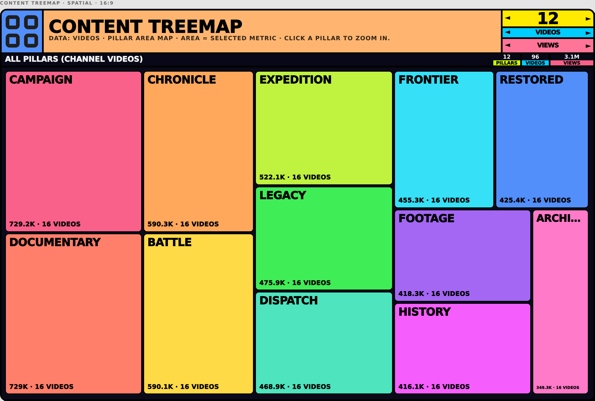
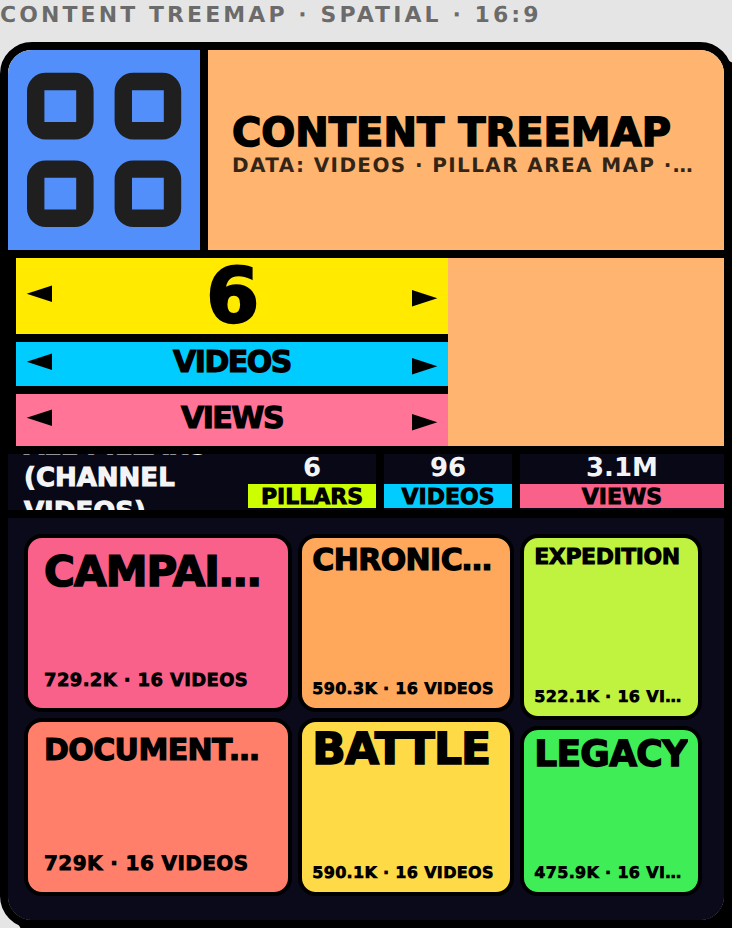
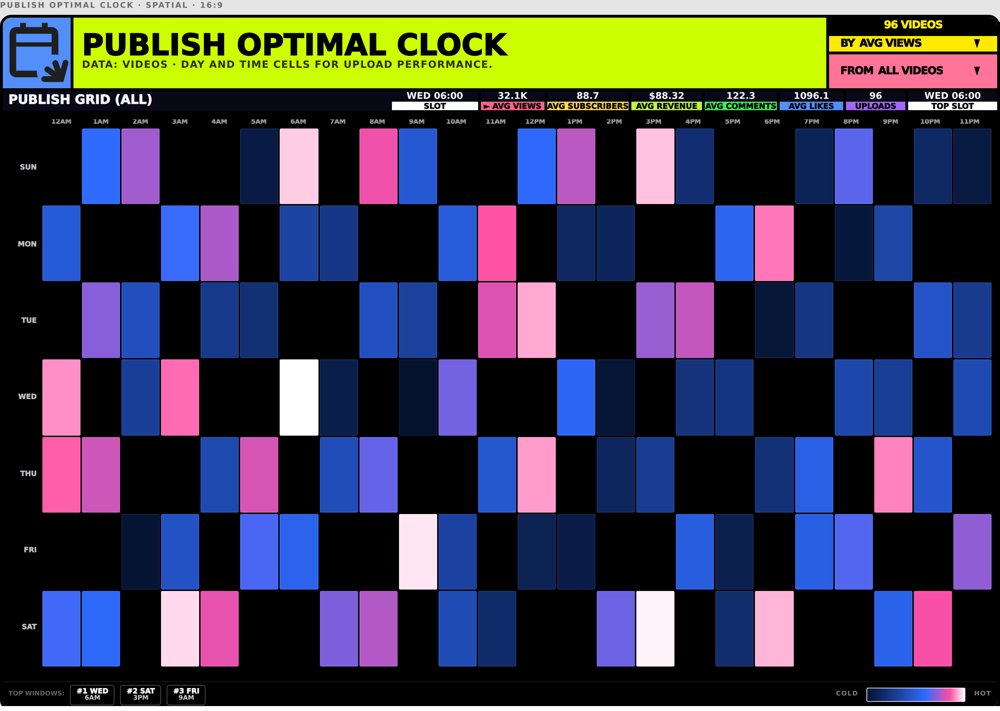
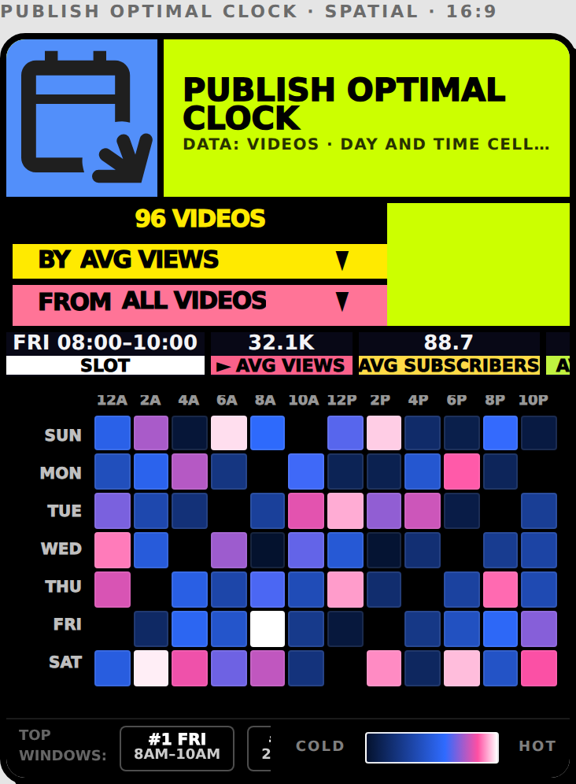
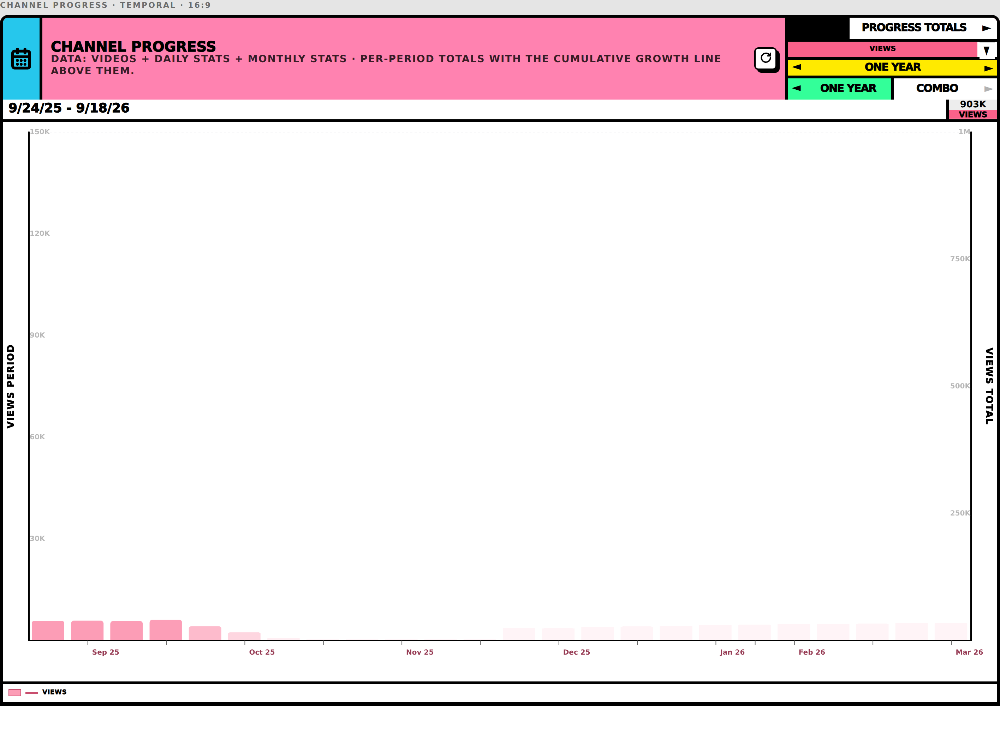
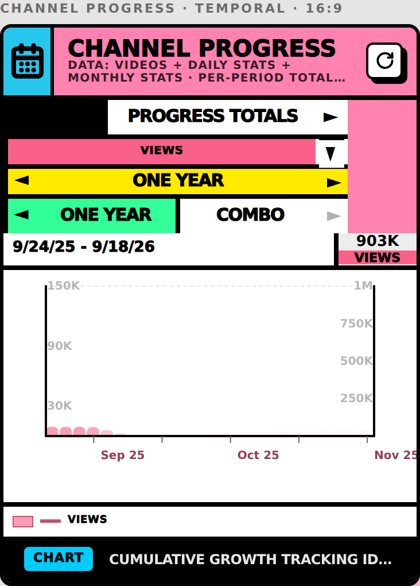
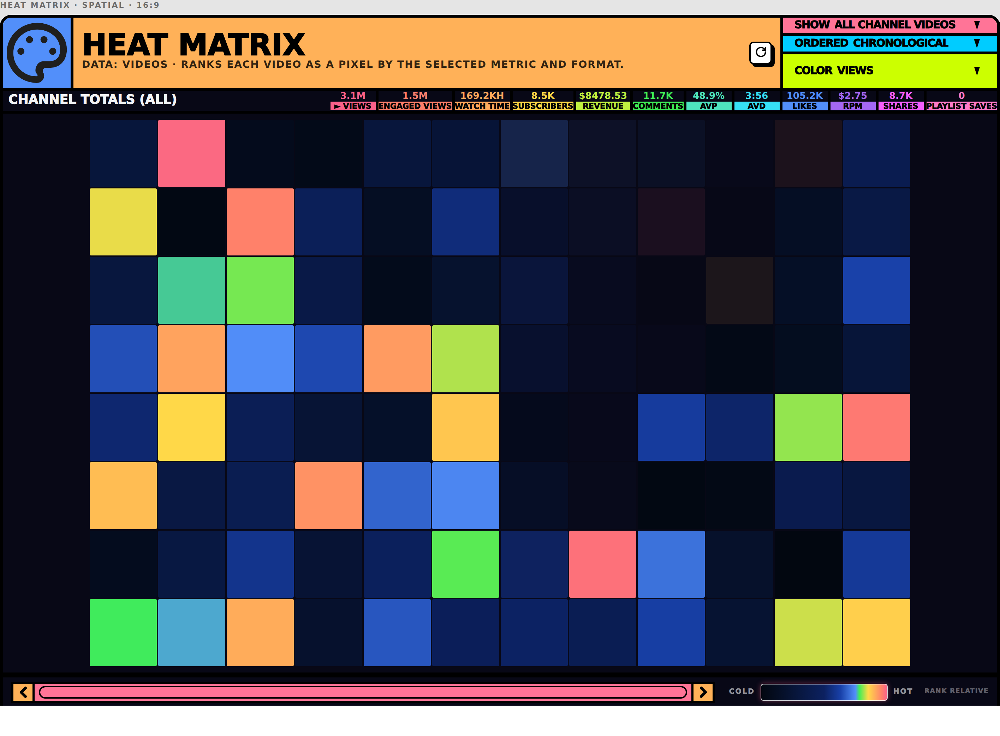
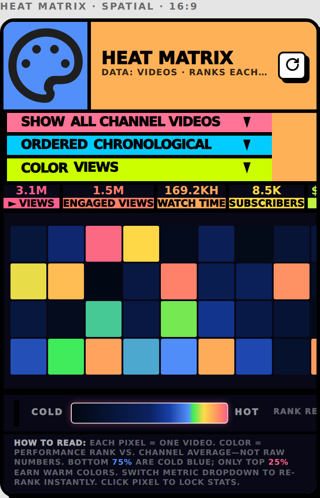

# Screenshots — Data Visual controller unification (phases 0–4)

Every capture is the **built app** (`npm run build` + `vite preview`) on the
deterministic audit bench, not a prototype or a design mock.

| Field | Value |
|---|---|
| Route | `/render-bench/data-visual-audit?only=<id>` |
| Branch@sha | `claude/viewtube-data-visual-responsive-qyk8rp@2da2817` |
| Data | **fixture** — `src/views/bench/dataVisualAuditFixture.ts`, seeded PRNG, fixed clock |
| Auth | **anon** — the bench is a bare route, no AppShell and no VT-SYNC snapshot |
| Captured | 2026-09-18 |

The bench renders the production module components, so the chrome under test
(controller column, stat row, header) is the real one. It is **not** evidence
about the live Analytics page, which mounts the same modules behind auth.

---

## Content Treemap

The one visual where a setting change measurably resized the chrome. Its three
stat cards now hold one width across every metric.

### 1440×1000

### 390×844

## Publish Optimal Clock

One of the six visuals whose authored row order changed hands in phase 4.

### 1440×1000

### 390×844

## Channel Progress

Widest controller column in the collection (300px), four rows including two
custom escape hatches.

### 1440×1000

### 390×844

## Heat Matrix

Three dropdown rows; the widest controller column driven purely by option labels.

### 1440×1000

### 390×844

---

**Not covered:** the 60-odd visuals not on the audit bench, the live Analytics
page behind auth, and the empty/loading/error states (the empty state is covered
separately by `VtSyncDataVisualsEmptyState.test.tsx`, which renders all 77
modules against an empty dataset).
