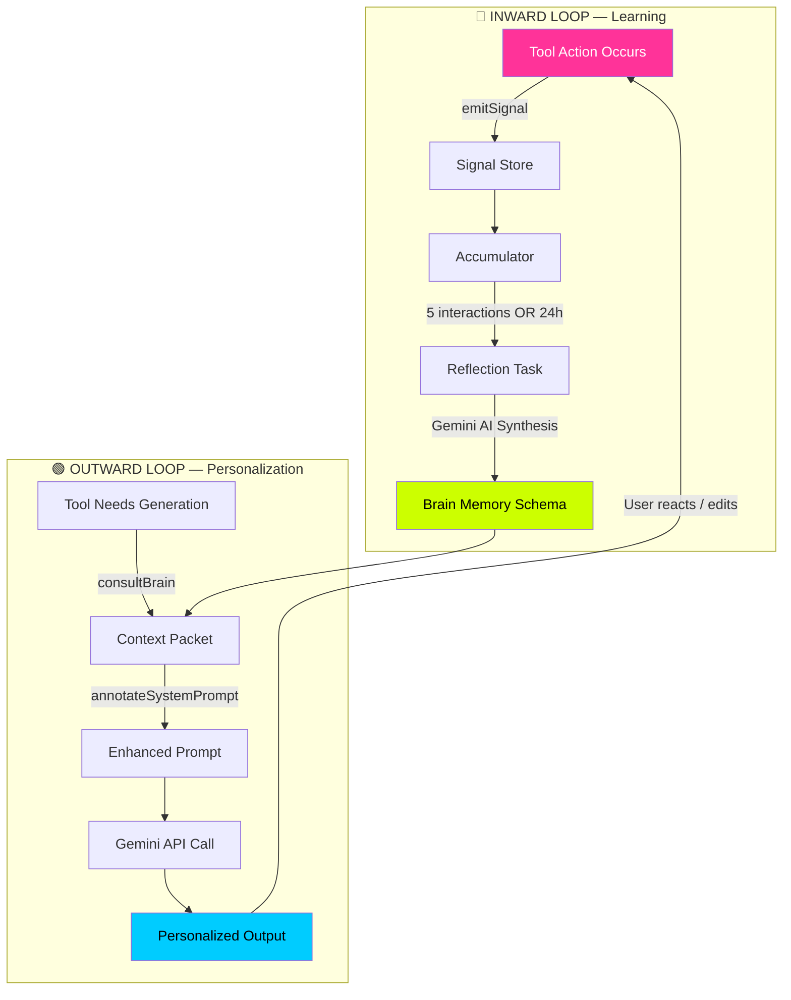
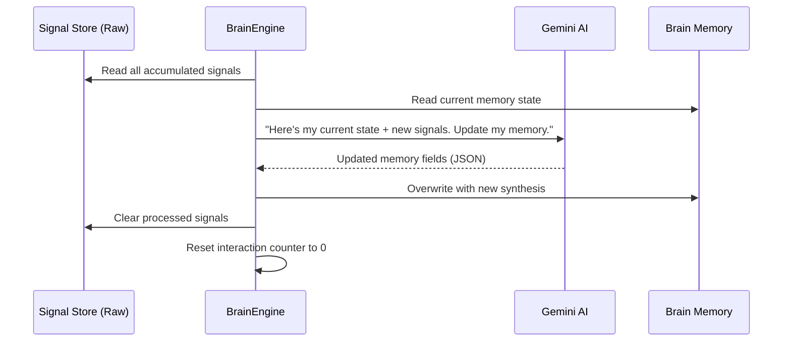

# ViewTube Brain — The Central Intelligence Layer

> **Version**: 1.0  
> **Status**: Phase 1 Implemented  
> **Last Updated**: 2026-05-04

---

## 1. What Is The Brain?

The Brain is ViewTube's **memory and reasoning engine**. It sits between every tool in the application and acts as a persistent, evolving intelligence that:

- **Remembers** everything the creator does, says, and generates
- **Learns** patterns from their behavior and analytics
- **Advises** every tool with personalized context before generation
- **Evolves** autonomously as new data arrives

Without the Brain, each tool operates in isolation — the SEO Generator doesn't know what the Journal said, the Script Assistant doesn't know what Analytics revealed. The Brain eliminates these blind spots.

---

## 2. The Double-Loop Architecture

The Brain operates on two continuous feedback loops:



### 2.1 The Inward Loop (Learning)

**Purpose**: Capture what happens across every tool interaction.

**How it works**:

1. A user does something in any tool (writes a journal entry, generates SEO titles, analyzes a video)
2. The tool calls `emitSignal(toolId, action, payload)`
3. The signal is stored in `localStorage` as a `BrainSignal`:

```typescript
{
  id: "uuid-here",
  toolId: "SEO_GENERATOR",        // Which tool emitted
  action: "TITLES_GENERATED",      // What happened
  payload: {                        // The data
    concept: "History of Rome",
    selectedTitle: "Why Rome ACTUALLY Fell (Nobody Talks About This)"
  },
  timestamp: 1714800000000
}
```

4. Signals accumulate until a **Reflection** is triggered

### 2.2 The Outward Loop (Personalization)

**Purpose**: Inject the Brain's knowledge into every AI generation.

**How it works**:

1. Before generating anything, a tool calls `consultBrain(toolId)` (or the sync variant `consultBrainSync(toolId)`)
2. The Brain reads its permanent memory and returns a **Context Packet**:

```typescript
{
  identityAndAspirations: "Creator focused on history/documentary content...",
  contentDNA: "Cinematic tone, dramatic narration, dark color palette...",
  performanceLedger: "Videos with personal hooks get 40% higher retention...",
  futureStateMap: "Planning a 10-part Roman Empire series for Q3...",
  learnedPreferences: "User dislikes clickbait hooks, prefers educational angle...",
  strategicAdvice: "CTR dropping on recent uploads — consider A/B testing thumbnails"
}
```

3. The tool calls `annotateSystemPrompt(basePrompt, contextPacket)` to inject this context directly into the AI prompt
4. The result: every generation is tailored to the creator's identity, goals, style, and current performance

---

## 3. The Brain Memory Schema

The Brain's permanent memory is organized into **four modules**:

| Module | What It Stores | Updated By |
|---|---|---|
| **Identity & Aspirations** | Who the creator is, their "Why," 1yr/5yr goals, channel handle, niche | AI Journal, Settings, manual input |
| **Content DNA** | Preferred tone, visual style (e.g., Neobrutalist, Cinematic), recurring themes, brand voice keywords | Journal, SEO patterns, Thumbnail choices |
| **Performance Ledger** | Key analytics takeaways — what works, what doesn't, CTR trends, retention patterns | Analytics Sync, PerformanceHub, CSV imports |
| **Future-State Map** | Upcoming projects, planned series, business pivots, content calendar goals | Journal entries, Project Studio, Calendar |

```typescript
interface BrainMemorySchema {
  identityAndAspirations: string   // Dense, strategic summary
  contentDNA: string               // Style + tone fingerprint
  performanceLedger: string        // Analytics intelligence
  futureStateMap: string           // Forward-looking plans
  interactionCount: number         // Triggers reflection at 5
  lastReflection: number           // Timestamp of last compression
  tools: string[]                  // Auto-discovered tool registry
}
```

> [!IMPORTANT]
> Memory fields are **dense natural-language summaries**, not raw data. This keeps the context window small when injected into prompts.

---

## 4. The Reflection Step

The Reflection is where raw signals get **compressed into wisdom**.

### When It Triggers
- After **5 tool interactions** (any combination of tools)
- OR after **24 hours** since last reflection
- Whichever comes first

### What Happens



### The Prompt

The Reflection uses Gemini to synthesize. The prompt says:

> "You are the ViewTube Brain. Here's my current memory state and recent signals. Identify user preference patterns, resolve conflicts between stated goals and analytics reality, and return updated memory fields."

### Why Compression Matters

Without compression, signals would grow unbounded and bloat the context window. The Reflection step ensures the Brain's memory stays **dense, strategic, and actionable** — never more than a few hundred tokens per module.

---

## 5. Dynamic Prompt Annotation

Every AI generation in ViewTube can be enhanced with Brain context. Here's the flow:

### Before (Without Brain)
```
SYSTEM: You are a viral YouTube strategist.
USER: Generate 3 titles for "History of Rome"
```

### After (With Brain)
```
SYSTEM: You are a viral YouTube strategist.

--- [GLOBAL USER CONTEXT / BRAIN INJECTION] ---
IDENTITY & ASPIRATIONS: History/documentary creator targeting 100K subs by Q4.
  Channel: @themotionvisual. "Why": Make history accessible and cinematic.
CONTENT DNA: Cinematic tone, dramatic narration. Avoids clickbait.
  Prefers educational hooks with emotional payoff.
PERFORMANCE LEDGER: Personal-story hooks get 40% higher retention.
  Shorts with fast cuts outperform by 2x. CTR declining on text-heavy thumbnails.
FUTURE STATE MAP: Planning 10-part Roman Empire series.
  Next upload: "The Fall of Constantinople" — targeting history/education niche.
LEARNED PREFERENCES: User dislikes exaggerated claims. Prefers "earned surprise"
  over shock value. Edited out all-caps from last 3 generated titles.
-----------------------------------------------

USER: Generate 3 titles for "History of Rome"
```

The difference: the AI now knows the creator's voice, goals, what works, and what to avoid. Every generation becomes **deeply personalized**.

---

## 6. Tool Integration Protocol

### For Existing Tools

Any tool integrates with the Brain in **two lines of code**:

```typescript
// INWARD: After the tool does something
emitSignal('TOOL_NAME', 'ACTION_NAME', { relevant: 'data' })

// OUTWARD: Before generating AI content
const ctx = consultBrainSync('TOOL_NAME')
const enhancedPrompt = annotateSystemPrompt(basePrompt, ctx)
```

### For New Tools (Discovery Protocol)

When a new tool calls `emitSignal()` for the first time with a previously unseen `toolId`, the Brain **automatically registers it**:

```typescript
// Inside emitSignal():
if (!schema.tools.includes(toolId)) {
  schema.tools.push(toolId)  // Auto-discovery, no migrations needed
}
```

No database migrations. No manual schema updates. The Brain expands its awareness autonomously.

### Current Integration Status

| Tool | Inward (emitSignal) | Outward (consultBrain) |
|---|---|---|
| AI Chatbot (SidebarChatbot) | ✅ Emits `USER_MESSAGE` signals | ❌ Not yet |
| Idea Spark (generateIdeaSpark) | ❌ Not yet | ✅ Injects Brain context |
| SEO Generator | ❌ Not yet | ❌ Not yet |
| Storyboard Studio | ❌ Not yet | ❌ Not yet |
| Thumbnail Studio | ❌ Not yet | ❌ Not yet |
| Analytics / PerformanceHub | ❌ Not yet | ❌ Not yet |
| AI Journal | ❌ Not yet | ❌ Not yet |
| Script Assistant | ❌ Not yet | ❌ Not yet |

---

## 7. Conflict Resolution

One of the Brain's most powerful capabilities: detecting **tensions** between what the user *says* and what the data *shows*.

### Example Scenario

| Source | Data |
|---|---|
| **AI Journal** | "I want to pivot to tech reviews" |
| **Analytics** | "History videos perform 400% better than everything else" |

### What The Brain Does

During the Reflection step, the Gemini synthesis prompt explicitly asks:

> "Identify conflicts between stated goals and performance data. Surface these as Strategic Advice."

The resulting `ContextPacket` would include:

```
strategicAdvice: "TENSION DETECTED: You stated a desire to pivot to tech reviews,
but your history content consistently outperforms by 4x. Consider: a hybrid format
(tech history), or a dedicated second channel for tech content, rather than
abandoning your highest-performing format."
```

This advice gets injected into every subsequent generation, ensuring the AI doesn't blindly follow the stated goal without acknowledging reality.

---

## 8. Data Flow: End-to-End Example

Let's trace a complete cycle through both loops:

### Step 1: User writes in AI Journal
> "I'm feeling burnt out on history videos. Want to try tech reviews."

**Inward Loop fires:**
```typescript
emitSignal('AI_JOURNAL', 'USER_MESSAGE', {
  text: "I'm feeling burnt out on history videos. Want to try tech reviews.",
  category: 'goals'
})
```

### Step 2: Signals accumulate (4 more interactions happen)

### Step 3: Reflection triggers
- Brain reads current memory + 5 new signals
- Gemini synthesizes: updates `futureStateMap` with tech review interest
- Gemini detects conflict: analytics say history dominates → adds note to `performanceLedger`

### Step 4: User generates SEO titles for next video
```typescript
const ctx = consultBrainSync('SEO_GENERATOR')
// ctx.strategicAdvice now contains the tension warning
const prompt = annotateSystemPrompt(seoBasePrompt, ctx)
// Gemini generates titles aware of the conflict
```

### Step 5: Generated titles reflect the nuance
Instead of pure tech review titles, the AI might suggest:
- "The Tech That Built Rome (And Why Silicon Valley Copied It)"
- Bridging the creator's interest in tech WITH their proven history strength

---

## 9. Storage Architecture

```
localStorage
├── vt_brain_memory_schema    → BrainMemorySchema (permanent, compressed)
├── vt_brain_signals          → BrainSignal[] (temporary, cleared on reflection)
└── vt_workspace_brain        → WorkspaceBrain (existing app state)
```

> [!NOTE]
> Phase 1 uses `localStorage` for simplicity and zero-infrastructure deployment. Future phases could migrate to IndexedDB (for larger storage) or a cloud-synced vector database (for semantic search across past scripts/videos).

---

## 10. Future-Proofing: The Roadmap

### Phase 2: Full Tool Coverage
- Wire `emitSignal` into all 30+ generation functions in `gemini.ts`
- Wire `consultBrainSync` into all generation prompts

### Phase 3: Post-Action Reflection UI
- After every AI generation, show a lightweight 👍/👎 + optional text feedback
- Feed this directly into `emitSignal` as learned preferences
- Recursive personalization: future generations for that tool prioritize these preferences

### Phase 4: Brain Dashboard
- Visual UI showing the 4 memory modules
- Creator can edit/override any module
- Timeline view of signal history and reflection events

### Phase 5: Semantic Memory (Vector DB)
- Store past scripts, video analyses, and journal entries as embeddings
- `consultBrain` can do semantic search: "What worked last time I made a video about X?"
- Enables true long-term creative memory

### Phase 6: Multi-Source Intelligence Fusion
- Merge Private API data (CTR, AVD, subscriber growth)
- External market data (Google Trends, competitor analysis)
- User narrative data (Journal, feedback)
- Brain identifies "gaps" between aspiration and reality

---

## 11. File Reference

| File | Role |
|---|---|
| `src/types.ts` | `BrainSignal`, `ContextPacket`, `BrainMemorySchema` type definitions |
| `src/services/brainEngine.ts` | Core engine: `emitSignal()`, `consultBrain()`, `reflectAndCompress()`, `getBrainMemory()`, `saveBrainMemory()` |
| `src/services/brainUtils.ts` | Sync helpers for use inside `gemini.ts`: `consultBrainSync()`, `annotateSystemPrompt()` |
| `src/context/GlobalDataContext.tsx` | Exposes `emitSignal` and `consultBrain` via React context to all components |

---

## 12. Key Principles

1. **Additive, never destructive** — Brain integration never changes existing tool behavior. It only enhances prompts.
2. **Dense over verbose** — Memory is compressed natural language, not raw data dumps.
3. **Autonomous discovery** — New tools self-register. No migrations.
4. **Conflict-aware** — The Brain doesn't just store data. It reasons about tensions.
5. **Privacy-first** — All data stays in `localStorage`. Nothing leaves the browser except Gemini API calls the user already authorized.
