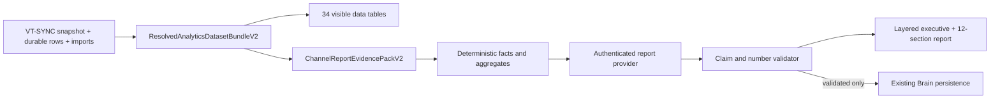

# Intelligence Hub Evidence Flow V2

Status: canonical implementation resource  
Updated: 2026-08-30  
Runtime surface: `/analytics#intelligence`

## Authority

The Intelligence Hub may make channel-specific factual or numeric claims only from the resolved VT-SYNC bundle for the current channel, snapshot, time window, and privacy fingerprint. Brain memory, creator intent, prior reports, and promoted learnings are advisory context; they are not numeric evidence.

## Contracts

- `ResolvedAnalyticsDatasetBundleV2`: complete resolved rows, stable row identities, sources, freshness, dataset versions, and bundle/privacy fingerprints.
- `ChannelReportEvidencePackV2`: 34-dataset manifest, deterministic facts, aggregate formulas, source evidence IDs, contradictions, and missing inputs.
- `LayeredChannelReportV2`: executive layer plus the existing detailed report lifecycle, claims, schema/prompt versions, and validation state.
- `POST /api/intelligence/channel-report`: authenticated, channel-scoped, server-owned Gemini execution. Creator rows and narrative output are not written to server logs.

## Reliability rules

1. Missing data renders as “Not enough evidence,” never a placeholder zero.
2. Shorts and long-form aggregates remain separate when format data exists.
3. Factual and observational claims require current evidence IDs.
4. Any number not present in a deterministic fact is rejected.
5. Benchmarks, forecasts, keyword volume, competition, causality, and expected impact are unavailable unless explicitly supplied as evidence.
6. One repair request is allowed. If validation still fails, invalid claims are removed and affected sections degrade.
7. Brain writes require a valid report, matching channel/snapshot/bundle/privacy scope, and resolvable claim evidence.

## Local development

`npm run dev` starts the API bridge on port 3000, waits for its account snapshot, then starts Vite on port 5173. Vite proxies `/api` to the API bridge. Because the API bridge is a separate Node process, changes under `server/` require restarting `npm run dev`; Vite HMR cannot reload them.

During VT-SYNC, repeated `POST /api/account/google-proxy` lines are normally distinct YouTube Data and Analytics request bundles, with bounded retry handling. Diagnose a loop using request fingerprints, completion states, and retry classifications—not route-entry count alone. Never log access tokens, full query strings, creator rows, or report prose.

## Release gates

- Visible table, export, visual, and report use the same bundle fingerprint.
- API-only, CSV-supplemented, recovered, stale, partial, privacy-filtered, and missing data fixtures pass.
- Every model claim and number validates against the current evidence index.
- Failed or mismatched reports cannot update Brain knowledge.
- Focused tests, typecheck, production build, `git diff --check`, authenticated desktop/mobile browser QA, and protected-preview QA are recorded before promotion.

## Historical inputs

The pasted Intelligence Hub code, `PROMPT-DESIGN-IDEAS.txt`, and the Adaptive Intelligence donor kit are design references only. They do not authorize client-side API keys, mock analytics, JSON-repair parsing, unsupported benchmarks, parallel Brain registries, or a second runtime.
