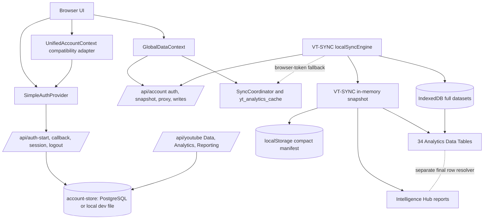

# ViewTube Auth, Login, Google API, Sync, Analytics, and Data Authority Audit

Status: canonical current-state resource and replacement plan  
Audited: 2026-08-30  
Checkout: `codex/chore/branch-check-version-2026-08-27`  
HEAD: `788814a20c8f94c374dbeb84992412a8ef390fef`  
Runtime surface: `/analytics` (also routed as `/local-analytics` and `/vt-sync-local`)  

> This records the inspected working tree, including uncommitted user-owned work. It is not a claim about production configuration or Google OAuth approval. Recheck the branch, environment, deployed routes, and live API responses before implementation or release.

## 2026-08-30 implementation update

The Intelligence Hub portion of the earlier finding is now being replaced in this working tree. `ResolvedAnalyticsDatasetBundleV2` resolves the 34 registered tables once, fingerprints the channel/snapshot/window/privacy scope, and supplies the same rows to the visible table and report gate. `ChannelReportEvidencePackV2` derives traceable facts and aggregate evidence before any model call. The authenticated `POST /api/intelligence/channel-report` route is mounted in both the deployment API wrapper and the local port-3000 API server.

This does not complete the wider auth and sync consolidation described below. VT-SYNC still performs many Google reads through `/api/account/google-proxy`; a full sync therefore produces a burst of route log lines. That burst is expected while distinct Data/Analytics request bundles are active. It is a retry loop only if the same upstream request fingerprint repeats after the sync reaches a terminal state. Current entry-only logs do not expose enough information to make that distinction from a screenshot alone.

The canonical report implementation and its remaining release gates are documented in `INTELLIGENCE_HUB_EVIDENCE_FLOW_V2.md`.

## Executive finding

ViewTube does not currently have one end-to-end source of truth for login, Google authorization, YouTube API access, synchronization, analytics storage, visible Data Table rows, or Intelligence Hub evidence.

Four generations coexist:

1. A server-session login flow in `server/simple-auth.mjs` exposed through `/api/auth-*` and `src/auth/AuthProvider.tsx`.
2. A second server OAuth/account flow in `server/account-auth.mjs` exposed through `/api/account/*`, plus overlapping aliases.
3. A legacy browser-token and `yt_analytics_cache` pipeline owned by `authSession`, `SyncCoordinator`, `DataStore`, and `Selectors`.
4. The newer VT-SYNC pipeline owned by `/analytics`, `localSyncEngine`, an in-memory snapshot, full IndexedDB datasets, a compact localStorage manifest, and table-specific row resolution.

The new session-backed `/api/youtube/*` Data, Analytics, and Reporting endpoints exist, but `/analytics` does not use them. Its sync engine still calls `/api/account/google-proxy` and can fall back to browser OAuth tokens. The visible tables and the Intelligence Hub also do not consume one identical resolved-row contract. As a result, a user can be shown as connected while a different auth path performs the sync, the page can display rows that reports do not receive, and old documentation can describe infrastructure that is no longer authoritative.

## Authority labels

Use these labels in future docs, skills, comments, and migration work:

- **Canonical**: the intended sole runtime owner after consolidation.
- **Transitional**: currently used, but must be adapted or removed.
- **Legacy**: retained only until named consumers migrate; never use for new work.
- **Historical**: useful for debugging lineage only; never a runtime instruction.
- **Proposed**: not implemented and must not be described as current behavior.

## Current runtime map



The dotted relationships are the highest-risk contradictions: they represent fallback or parallel behavior that prevents a single reliable authority.

## Source-of-truth matrix

| Domain | Current live owner(s) | Contradiction or wrong information | Required disposition |
| --- | --- | --- | --- |
| ViewTube session | `SimpleAuthProvider` -> `GET /api/auth-session` -> `simple-auth.mjs` -> `vt_session` | `auth-canon` still treats a browser Google token as decisive; other surfaces still read legacy auth state | Make the server session the only authentication authority |
| Google identity and channel connection | Both `simple-auth.mjs` and `account-auth.mjs` | Two start/callback implementations, different return behavior, scope sets, and frontend callers | Keep one OAuth implementation and one callback contract |
| Capability state | Session capability booleans, account snapshot capabilities, browser token checks, feature gates | “Signed in,” “Google connected,” “scope granted,” and “operation allowed” are still conflated | Publish one server-derived capability contract with separate states |
| Google access token | Server-encrypted credential record plus legacy browser token storage | `googleReadTransport` and VT-SYNC can fall back to a browser token after proxy failure | Remove browser-token fallback after server parity is proven |
| YouTube Data API | `/api/youtube/*`, `/api/account/google-proxy`, older fetchers | The new typed server facade is used by Video Manager but not the Analytics sync | Route all owner-data reads through one server API client |
| YouTube Analytics API | `/api/youtube/analytics/query`, account proxy, legacy fetchers, VT-SYNC request bundles | Query validation exists in the new server route, but canonical `/analytics` bypasses it | Make the validated server route the only query executor |
| YouTube Reporting API | `/api/youtube/reporting/*` and older planning code | Jobs and downloads exist but are not integrated into the canonical dataset ingest/provenance model | Ingest Reporting rows through the same dataset contract |
| Sync orchestration | `SyncCoordinator`, `canonicalSync`, and VT-SYNC `localSyncEngine` | Three orchestration concepts and multiple event families remain | Make one channel-scoped sync orchestrator; adapters may preserve old UI temporarily |
| Analytics storage | `yt_analytics_cache`, VT-SYNC memory, IndexedDB, compact manifest, CSV imports | Old docs call localStorage the ledger; newer code says full data belongs in IndexedDB | IndexedDB owns complete datasets; localStorage is metadata/boot state only |
| Data Tables | Registry-driven VT-SYNC models plus table-local import/recovery resolution | Visible rows can differ from snapshot consumers and reports | Move final row resolution into one shared canonical dataset service |
| Intelligence Hub | `analytics-canon/intelligenceEvidence.ts` | It receives a capped sample rather than the visible table’s exact resolved evidence | Generate section-specific aggregates and traceable evidence from canonical datasets |
| Brain persistence | Ultimate Report -> Tool Context / Channel Knowledge | Weak or sampled report claims can become future Brain context | Block persistence until claim-level evidence validation passes |

## Outdated and misleading resources

### `src/services/auth-canon/README.md`

Classification: **Historical/Transitional**.

The document says browser `unifiedAuth.isAuthenticated()` is the live OAuth truth and that `useUnifiedAccount()` is derived from a cached account snapshot. The inspected code now says the opposite: `UnifiedAccountContext` is a compatibility projection of `SimpleAuthProvider`, whose truth is the server response from `/api/auth-session`.

It also says browser-token presence should control YouTube API viability. That is incompatible with HttpOnly server sessions and server-owned encrypted refresh credentials. Only two source files currently import `auth-canon`, so its “single source of truth” claim is aspirational rather than true.

Disposition: replace the README after the canonical session/capability contract is selected; do not extend its token-present reconciliation model.

### `src/services/analytics-canon/README.md`

Classification: **Partially current, mostly migration plan**.

Its intended direction is correct: VT-SYNC should own analytics and legacy `DataStore`/`Selectors`/`SyncCoordinator` should retire. Its statements that every consumer already reads through `analytics-canon` and that CSV rows already land in one universally shared snapshot are not current runtime facts.

Audit counts in this working tree:

- 72 source files still match direct legacy analytics imports/references.
- 5 source files import or reference `SyncCoordinator` as a dependency.
- 26 source files directly reference VT-SYNC snapshot access/subscription.
- The Data Table still has a table-local final row resolver for immediate imports and recovered rows.

Disposition: retain as migration history, but replace it with this resource plus a generated consumer ledger. Do not call `analytics-canon` complete until direct-import gates reach zero.

### Installed `managing-viewtube-sync-coordinator` skill

Classification: **Historical**.

Wrong or stale claims:

- Calls `src/services/canonicalAnalyticsStore.ts` the ledger; that file does not exist.
- Describes “Unified Ledger Only” while the current coordinator writes `analytics/DataStore` and `yt_analytics_cache`.
- Says localStorage owns persistence; current VT-SYNC stores complete rows in IndexedDB and only a compact manifest in localStorage.
- Recommends incrementing a schema version to force a refresh without first protecting channel-scoped durable datasets.

Disposition: supersede with the proposed combined skill; retain only for lineage until migration finishes.

### Installed `debugging-viewtube-youtube-api` skill

Classification: **Useful query notes, stale system map**.

Still useful:

- Metric/dimension compatibility must be validated.
- Video filters must be batched to API-supported sizes.
- Data API and Analytics API have distinct endpoints and contracts.

Stale claims:

- Treats `yt_analytics_cache` population as the success criterion.
- Points to `src/services/youtube/RequestQueue.ts`; the inspected legacy queue import is `src/utils/RequestQueue`.
- Does not account for the server-side `/api/youtube/analytics/query` validator or VT-SYNC/IndexedDB authority.

Disposition: move only the verified query-shape rules into the new skill’s API reference.

### `AccountConnectPage` user-facing copy

Classification: **Misleading current UI**.

The page says Google uses “read-only YouTube scopes.” The simple auth scope set includes `youtube.force-ssl`, which permits YouTube account actions, and monetary analytics. The second account OAuth flow additionally requests upload. The UI therefore understates requested access and does not explain incremental capability grants.

Disposition: update only after one scope policy is implemented. The UI must list base permissions separately from optional write, upload, monetary, or Content Owner access.

## Confirmed implementation contradictions

### Login and auth

- `SimpleAuthProvider` calls `/api/auth-start`, `/api/auth-session`, and `/api/auth-logout`.
- `UnifiedAccountContext` declares Simple Auth the only truth and projects it into an older account shape.
- `GlobalDataContext.connectChannel()` still tries the account snapshot/intent flow first, then falls back to browser OAuth and direct-token boot logic.
- Both server OAuth implementations use the same account store and `vt_session` cookie but have different start methods, callbacks, redirect semantics, scope policies, and error contracts.
- Account/logout/revoke semantics are distributed across both endpoint families.

### Google and YouTube APIs

- The new `/api/youtube/*` routes keep Google tokens on the server and validate Analytics query shapes.
- Video Manager uses parts of this new facade but still imports legacy auth, `UnifiedAccountContext`, the asset catalog, and `readYouTubeAnalyticsCache`.
- VT-SYNC instead constructs Google URLs in the browser and sends them through `/api/account/google-proxy`; on selected failures it can retrieve a browser token and call Google directly.
- The account OAuth and simple OAuth scope lists differ, so capability availability depends on which login path the user reached.

### Sync and storage

- `SyncCoordinator` remains active for GlobalData and several legacy views and writes `yt_analytics_cache`.
- `/analytics` is intentionally isolated from that legacy cache and runs `localSyncEngine`.
- `canonicalSync` exists as a third orchestration/migration layer and still imports legacy analytics types or bridges.
- VT-SYNC correctly keeps complete rows in IndexedDB, keeps the active snapshot in memory, and writes a row-free manifest to localStorage.
- Manual CSV and durable API rows are channel-scoped, but immediate table feedback still uses component-local state before every consumer sees an identical resolved bundle.

### Data Tables and Intelligence Hub

- The table registry declares 34 visible Analytics datasets.
- The page merges persisted API rows, manual imports, video inventory, live rows, and privacy filters into snapshots.
- `VtSyncToolboxDataTable` performs an additional `resolveAnalyticsTableRows()` step for local imported/recovered rows.
- The Intelligence Hub calls `buildCanonicalIntelligenceEvidence()` on the page snapshot, not the table’s final resolved rows.
- Evidence is bounded to eight rows per dataset and 24,000 characters for all datasets combined.
- Dataset-level source labels are inferred; evidence IDs are sample positions rather than durable row/source references.
- Ultimate Report output can be associated with broad evidence collections and written into Brain context without proving each factual claim.

## Replacement architecture

### One account and Google authorization contract

Use the existing server session/account store as the foundation, but collapse OAuth to one implementation.

Canonical endpoint family:

- `GET /api/auth/session` — server-verified session, user, channel, connection, grants, and capabilities.
- `GET /api/auth/google/start?intent=&returnTo=` — one PKCE + nonce + state authorization start.
- `GET /api/auth/google/callback` — one callback and redirect/error contract.
- `POST /api/auth/logout` — revoke the ViewTube session only.
- `POST /api/auth/google/revoke` — revoke/disconnect Google separately.
- `/api/account/*` — profile, billing, onboarding, and account management; no second OAuth implementation.

The response must keep these states separate:

```ts
type ViewTubeAccessSnapshot = {
  session: "loading" | "anonymous" | "authenticated"
  google: "disconnected" | "connected" | "reconnect_required"
  channel: "unknown" | "missing" | "ready"
  capabilities: {
    youtubeRead: boolean
    analyticsRead: boolean
    monetaryRead: boolean
    commentsWrite: boolean
    videoManage: boolean
    upload: boolean
    contentOwner: boolean
  }
  grantedScopes: string[]
  channelId: string | null
}
```

Base authorization should request only identity, channel read, and non-monetary Analytics read. Request monetary, comments/video management, upload, or Content Owner scopes incrementally when the user invokes those features. Cached snapshots may render labels but may never grant access.

### One server-side Google API facade

Build on `/api/youtube/*`; remove arbitrary client-supplied Google URLs from the long-term contract.

- Data API routes own channel identity, uploads inventory, video details/statistics, playlists, and comments.
- Analytics API accepts a typed query-family identifier plus dates, filters, paging, and allowed metric options. The server expands and validates the exact metric/dimension set.
- Reporting API owns report-type discovery, jobs, report listing, download validation, and ingestion metadata.
- Every response includes a request ID, channel ID, source family, fetched timestamp, query fingerprint, freshness, and structured error classification.
- The server owns refresh tokens, retries, reconnect marking, scope checks, quota/rate classification, and allowed upstream hosts.

### One sync and canonical dataset pipeline

Make VT-SYNC the canonical orchestrator, but split the current large local engine into typed phases that call the server API facade:

1. Session and capability preflight.
2. Channel identity bootstrap.
3. Data API inventory sync.
4. Analytics query-family sync.
5. Reporting ingest when enabled and available.
6. Normalize rows into canonical dataset records.
7. Persist complete channel-scoped datasets to IndexedDB.
8. Publish one immutable dataset manifest/version to all consumers.

Each canonical dataset result must include:

```ts
type CanonicalDataset<T> = {
  datasetId: string
  channelId: string
  snapshotId: string
  selectedWindow: string
  rows: T[]
  rowCount: number
  source: "youtube_data_api" | "youtube_analytics_api" | "youtube_reporting_api" | "csv"
  sourceRecords: Array<{
    sourceRecordId: string
    fetchedAt: string
    queryFingerprint: string
  }>
  freshness: "fresh" | "stale" | "partial" | "failed" | "unavailable"
  missingMetrics: string[]
  privacyPolicyVersion: string
}
```

CSV rows remain supplemental and must preserve `source="csv"`; they may fill missing fields or append new identities according to a dataset-specific merge rule, but must not silently overwrite newer API facts.

### One row resolver for tables, visuals, reports, and Brain

Move `resolveAnalyticsTableRows()` out of the React table component into a shared canonical dataset service. The following consumers must receive the same dataset version and resolved rows:

- Analytics Data Tables
- Data Visuals
- Dashboard analytics widgets
- Data Transparency and exports
- Intelligence Hub
- Brain onboarding, Tool Context, and Channel Knowledge

The Intelligence Hub should receive deterministic aggregates and section-specific evidence, not a single global text sample. Every numeric or factual claim must reference durable evidence IDs that resolve to a dataset version, source record, row, or aggregate. Unsupported claims are rejected or labeled as inference. Unverified reports must not enter Brain persistence.

## Proposed combined skill and workflow

Create a repository-owned skill at:

`skills/viewtube-google-auth-sync-analytics/`

Use this package shape:

```text
viewtube-google-auth-sync-analytics/
├── SKILL.md
├── agents/openai.yaml
├── references/
│   ├── authority-map.md
│   ├── auth-and-scope-contract.md
│   ├── youtube-api-query-families.md
│   ├── sync-storage-and-table-contract.md
│   └── diagnostics-and-acceptance.md
└── scripts/
    └── audit-authority-drift.mjs
```

### Skill identity

- Name: `viewtube-google-auth-sync-analytics`
- Automatic invocation: enabled.
- Trigger when work touches ViewTube login, session, OAuth, Google scopes, YouTube Data/Analytics/Reporting APIs, channel sync, Analytics storage, Data Tables, analytics evidence, or auth/sync production diagnosis.
- Do not trigger for generic YouTube content strategy, thumbnails, or non-ViewTube projects.

### Skill workflow

1. **Establish authority** — inspect route, provider, server handler, storage owner, active channel, and current migration status before proposing changes.
2. **Classify the operation** — authentication, Google connection, capability grant, Data API, Analytics API, Reporting API, synchronization, dataset read, or report evidence.
3. **Reject stale shortcuts** — cached auth is display-only; no browser token fallback; no `yt_analytics_cache` as new authority; unavailable is not zero; no arbitrary Google proxy URL for new code.
4. **Validate API shape** — choose the API family, validate metrics/dimensions/filters, monetary scope, batching, paging, and quota cost before calling.
5. **Preserve provenance** — attach channel, snapshot, source, query fingerprint, fetch time, row identity, freshness, and missing metrics.
6. **Verify consumer parity** — prove the visible table, visuals, report evidence, and exports use the same dataset version.
7. **Verify runtime** — run focused tests, browser login/reconnect/sync checks, API network inspection, IndexedDB validation, and production route probes before completion claims.

### Skill references

- `authority-map.md`: current canonical owners, compatibility adapters, forbidden new dependencies, and retirement ledger.
- `auth-and-scope-contract.md`: session states, logout vs revoke, incremental Google scopes, capability mapping, cookies, PKCE/state/nonce, trusted origins, and Google verification boundaries.
- `youtube-api-query-families.md`: Data vs Analytics vs Reporting responsibilities, supported metric/dimension families, batching, paging, monetary requirements, and structured errors.
- `sync-storage-and-table-contract.md`: orchestration phases, IndexedDB authority, compact manifest rules, CSV merge policy, dataset schema, row resolver, privacy/window enforcement, and evidence binding.
- `diagnostics-and-acceptance.md`: local and production preflight, test commands, browser scenarios, observability fields, rollback signals, and completion gates.

### Drift-audit script

`audit-authority-drift.mjs` should fail when it finds:

- New imports of legacy browser auth outside an explicit compatibility allowlist.
- New consumers of `yt_analytics_cache`, legacy `DataStore`/`Selectors`, or `SyncCoordinator`.
- More than one OAuth start/callback implementation after the consolidation phase.
- Analytics UI/report consumers bypassing the canonical dataset barrel.
- Data Table and Intelligence evidence contracts with different dataset IDs or resolver versions.
- Skills/docs claiming absent files are canonical.
- A skill without valid `name` and `description` YAML frontmatter.

The script should emit machine-readable JSON plus a concise terminal summary so Task Index and CI can consume the same evidence.

## Implementation plan

### Phase 0 — Freeze and measure authority drift

- Adopt this document as the audit baseline.
- Generate allowlisted import ledgers for legacy auth, analytics, sync, direct snapshot, and Google transport dependencies.
- Add the new skill package and drift-audit script; validate it with the bundled skill validator.
- Mark the existing auth-canon README and two installed sync/API skills historical until replaced.

Exit gate: CI reports the exact legacy consumer counts and prevents increases.

### Phase 1 — Consolidate login, session, and Google grants

- Select the simple server session flow as the canonical frontend contract.
- Fold required account-intent, popup/redirect, Content Owner, and account-management behavior into one OAuth implementation.
- Remove OAuth start/callback ownership from `account-auth.mjs`; keep account/billing/onboarding endpoints.
- Replace `GlobalDataContext.connectChannel()` account-first/browser-token fallback with the canonical auth provider and explicit post-login sync request.
- Introduce incremental scope requests and truthful permission copy.

Exit gate: one start handler, one callback, one session response, one cookie contract, and no browser token required for authenticated Google API calls.

### Phase 2 — Make `/api/youtube/*` the Google API boundary

- Replace arbitrary Google proxy URLs with typed server routes/query-family IDs.
- Move VT-SYNC Data and Analytics fetches onto the server facade.
- Centralize query compatibility, monetary scope checks, batching, paging, retry, quota, and reconnect behavior.
- Add source metadata and stable error codes to every response.

Exit gate: the `/analytics` page performs no direct Google request and has no browser-token fallback.

### Phase 3 — Consolidate sync, storage, and resolved datasets

- Make VT-SYNC the only active channel analytics orchestrator.
- Migrate remaining `SyncCoordinator` consumers through compatibility adapters, then remove its event/cache ownership.
- Keep full channel-scoped datasets in IndexedDB and localStorage metadata-only.
- Create the shared canonical dataset resolver and route tables, visuals, exports, and analytics widgets through it.
- Preserve API/CSV provenance and enforce channel, time-window, and privacy boundaries.

Exit gate: all 34 visible tables have exact row parity with canonical consumer datasets after live sync, reload, CSV supplement, and recovery.

### Phase 4 — Repair Intelligence Hub and Brain evidence

- Replace the global 24,000-character sample with structured, section-specific evidence bundles.
- Compute deterministic aggregates locally from complete canonical datasets.
- Require claim-level evidence IDs and validate numeric claims before rendering or persistence.
- Show dataset coverage, source, freshness, window, exclusions, and missing requirements in the report UI.
- Block Tool Context and Channel Knowledge writes for unverified reports.

Exit gate: every factual report claim is traceable to the same dataset version visible on `/analytics`.

### Phase 5 — Retire stale systems and publish the new workflow

- Remove legacy authSession usage, `yt_analytics_cache` reads, direct legacy analytics imports, and `SyncCoordinator` after their ledgers reach zero.
- Remove the account OAuth duplicate and obsolete aliases after one release of telemetry-backed compatibility.
- Replace outdated READMEs, skills, UI permission copy, and source comments with references owned by the new skill.
- Install the validated repository skill into Codex and confirm catalog discovery.

Exit gate: drift audit passes with no compatibility exceptions, focused/full tests pass, browser acceptance passes, and production OAuth/API probes are successful.

## Verification and acceptance matrix

| Area | Required scenarios |
| --- | --- |
| Session | anonymous, ready, expired/reconnect, revoked, logout, account deletion, refresh-token rotation |
| OAuth security | internal return target, state replay rejection, nonce mismatch, PKCE, wrong Google identity, trusted origin, cookie attributes |
| Scopes | base read, incremental monetary, comments/video management, upload, Content Owner; denied and revoked grants |
| Data API | complete uploads inventory, 50-item batching, pagination, private/unlisted owner data, quota/rate/reconnect errors |
| Analytics API | valid/invalid metric-dimension families, impressions/CTR rules, monetary checks, video filters, date windows, pagination |
| Reporting API | live report-type discovery, job lifecycle, delayed availability, validated download host, ingestion provenance |
| Storage | same-channel restore, channel switch isolation, IndexedDB unavailable, compact manifest, interrupted sync, CSV supplement |
| Tables | exact parity for all 34 datasets across API, persisted reload, import, privacy filters, and selected window |
| Intelligence | unavailable vs zero, stale/partial handling, valid evidence dereference, numeric claim verification, persistence rejection |
| Browser | login -> channel identity -> deferred sync -> table -> visual -> report; logout/reconnect; mobile responsiveness |
| Production | `/api/auth-start` redirects instead of returning 503, callback sets session, session reads correctly, API route uses server credential, deployment metadata matches tested commit |

## Current verification snapshot

Commands were run against the audited working tree without changing runtime code.

- Server auth/API contract tests: 16 passed, 0 failed.
- Focused client auth/analytics/table governance: 60 passed, 2 failed.
- `UnifiedAccountContext.simpleAuth.test.ts` fails because a negative string assertion finds `beginAccountIntent` in explanatory comments; the code does not import it. Replace this test with import/AST validation.
- `youtubeApiStabilization.governance.test.ts` correctly catches that Video Manager still imports `UnifiedAccountContext`, `VideoAssetCatalogContext`, legacy browser auth, and legacy analytics cache while also using the new server facade.
- Passing unit tests do not prove live OAuth credentials, Google verification, production cookie behavior, or dataset parity.

## Non-negotiable completion rules

- A cached account or analytics record is never permission authority.
- Missing or unavailable data is never converted to zero.
- Google tokens remain server-owned after the migration.
- Every dataset and report is channel-, window-, privacy-, source-, and snapshot-scoped.
- The visible Data Table and downstream consumers use the same resolved dataset version.
- Reports cannot write to Brain memory until their factual claims pass evidence validation.
- Do not delete a compatibility owner until its consumer ledger is zero and browser/production acceptance has passed.
