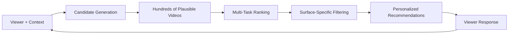
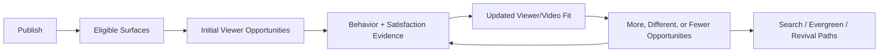
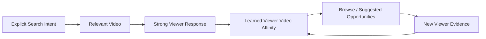

# How YouTube Recommendations and Discovery Work

## Quick-Reference Summary

YouTube recommendation and discovery is best understood as a **personalized retrieval and ranking system**, not a broadcasting system that simply pushes every upload to a fixed subscriber audience. When a viewer opens YouTube, performs a search, watches a video, or scrolls the Shorts Feed, YouTube selects candidates that appear relevant to that viewer and then ranks those candidates for the current surface and context.

> **Key distinction:** YouTube has published important engineering details about historical recommendation architectures, but it does **not** publish the exact current production model, signal weights, thresholds, or hyperparameters. Treat technical papers as strong architectural evidence, not as a complete blueprint of today's live recommender.

### At a Glance

| System layer | Core job | Typical evidence/signals | Creator implication |
|---|---|---|---|
| Candidate generation | Narrow a massive video corpus to a manageable candidate set | Watch/search history, co-watch patterns, contextual relevance, learned embeddings | A video first needs to be plausible for a particular viewer/context |
| Ranking | Order candidates for a surface | Predicted watch behavior, satisfaction signals, context, freshness and other learned features | No single public metric determines rank |
| Discovery surface | Apply surface-specific context | Home, Suggested, Search, Shorts, subscriptions, notifications, playlists and more | The same video can behave differently on different surfaces |
| Governance & safety | Apply quality, policy and authority constraints | Borderline-content classifiers, policy checks, authoritative-source signals in sensitive domains | Eligibility for recommendation is not only a popularity contest |

### System Flow



The most important practical idea is that **recommendation is viewer-relative**. A video is not simply "good for the algorithm" or "bad for the algorithm." It is more useful to ask: *for which viewers, on which surface, in which context, is this video a strong candidate?*

---

## Fundamental Architecture: Retrieval Before Ranking

Public YouTube/Google research describes a classic two-stage information retrieval pattern: **candidate generation** followed by **ranking**. This architecture exists because ranking every available video with an expensive model on every request would be computationally impractical. [S1][S2]

### Stage 1 — Candidate Generation (Nomination)

Candidate generation reduces the enormous video corpus to a much smaller set of plausible items for the current viewer.

Historically documented systems used deep neural embeddings and collaborative filtering to represent both viewers and videos in a learned vector space. Inputs could include watch history, search history, contextual features and other sparse signals. Videos whose learned representations were close to the current user/context representation became candidate recommendations. [S1][S2]

> **Strong evidence:** The 2016 YouTube engineering paper documents deep candidate-generation networks and approximate nearest-neighbor style retrieval from learned representations.

### Viewer and Context Representation

Historically documented input families included:

- recently watched videos;
- search-query tokens;
- co-watch relationships;
- contextual information;
- geography/device information;
- demographic information where available to the model;
- video age and freshness-related features. [S1][S2]

A useful conceptual simplification is:

```text
viewer/context representation
        +
video representation
        ↓
estimated relevance / affinity
        ↓
candidate pool
```

This is **not** a published current-production formula. It is a way to understand the retrieval concept described in the technical literature.

### Why Embeddings Matter

Embeddings let the system learn similarity from behavior instead of relying only on explicit metadata. Two videos can become related because similar viewers repeatedly watch them together even when their titles use different wording.

That creates several important creator implications:

1. Topic relationships can emerge from viewer behavior.
2. A video's audience context can matter as much as its literal keywords.
3. Recommendations may connect content through learned viewer patterns that are not obvious from metadata alone.
4. Metadata still matters strongly in explicit-intent systems such as Search, but recommendation is broader than metadata matching.

### Training at Massive Scale

The historical system treated next-watch prediction as an extreme multi-class problem with millions of possible video classes. Full softmax evaluation was computationally expensive, so training used sampled negative classes and importance correction. [S1][S2]

At serving time, the system could then retrieve likely candidates through efficient vector similarity rather than evaluate every video with the full ranking network.

### Freshness and the Age-of-Video Feature

Historical YouTube research explicitly discusses **example age** as a feature used to counteract the tendency of models trained on historical behavior to over-prefer older videos with more accumulated interactions. [S1][S2]

> **Strong evidence, historical architecture:** Freshness handling is documented in the 2016 architecture. Do not assume the exact same implementation or serving trick remains unchanged in 2026.

### Creator Takeaway

A newly uploaded video does not have to defeat every established video globally. It needs to become a plausible candidate for particular viewers and contexts, then perform well enough on the relevant surface to continue earning opportunities.

---

## Stage 2: Multi-Task Ranking and Scoring

After candidate generation, a more expensive ranking model evaluates the smaller candidate pool with richer features. Historically, YouTube moved beyond simple click prediction because optimizing only for clicks created incentives for clickbait. [S1][S2][S8]

### Expected Watch Time Instead of Pure CTR

The 2016 engineering paper describes a ranking objective where positive examples can be weighted by observed watch time. The core intuition is simple:

- a click followed by meaningful viewing can carry more utility than a click followed by immediate abandonment;
- a high CTR by itself does not guarantee a strong recommendation outcome;
- the model can learn expected watch value per impression rather than optimize clicks alone. [S1][S2]

> **Important limitation:** This does **not** mean current YouTube ranking is a single "expected watch time formula." YouTube has publicly described recommendation as multi-objective and satisfaction-aware.

### Multi-Task Ranking

Later Google research describes **multi-task ranking**, where the model predicts multiple user actions or satisfaction outcomes and combines them into a broader utility function. Multi-gate Mixture-of-Experts (MMoE) architectures are one documented approach. [S13]

A conceptual view:

| Prediction family | Example outcomes |
|---|---|
| Engagement | click, watch, continue watching, interact |
| Satisfaction | survey response, positive/negative feedback, longer-term utility |
| Context fit | surface, session, viewer intent, format |
| Quality/governance | eligibility, authority, policy confidence |

### Impression Churn and Repetition

Historical ranking research also describes features that account for whether a user has repeatedly seen and ignored an item. This helps avoid showing the same unwanted candidate indefinitely.

> **Creator interpretation:** Repeated impressions without a click can matter for that viewer/context, but creators should not translate this into a universal channel-level penalty.

### What YouTube Does Not Publish

YouTube does not publicly disclose:

- exact current weights for CTR, watch time, likes, dislikes, surveys or other actions;
- a single universal score required for recommendation;
- one retention threshold that guarantees distribution;
- a fixed number of "test impressions";
- a universal "algorithm phase" every upload follows;
- current production hyperparameters.

Any source claiming exact universal weights or thresholds should be treated skeptically unless YouTube publishes them directly.

---

## Satisfaction, Quality and Governance

YouTube has publicly emphasized that recommendations aim to optimize for **viewer satisfaction**, not simply maximize raw watch time. [S8]

### Satisfaction Signals

Public explanations describe a combination of:

- watch behavior;
- likes and dislikes;
- sharing;
- "Not interested";
- "Don't recommend channel";
- survey responses;
- other satisfaction models. [S8][S14]

Randomized post-watch satisfaction surveys are particularly valuable because they provide explicit feedback that behavioral metrics alone cannot capture.

### Why This Matters

A viewer may:

- click a video but dislike it;
- watch a long video because it is frustrating rather than satisfying;
- watch a short video completely and rate it highly;
- choose "Not interested" despite substantial watch time.

Therefore, **behavior needs context**.

### Borderline Content and Authoritative Sources

YouTube has publicly documented efforts to reduce recommendations of borderline content and to elevate authoritative sources for sensitive information categories. [S8]

> **Officially documented:** Recommendation eligibility is affected by platform safety and quality systems in addition to engagement.

> **Do not conclude:** A creator cannot infer that a distribution decline is a governance demotion merely from normal analytics. Policy systems are not exposed as a simple creator-facing ranking score.

---

## Core Viewer Signals and Creator Analytics

Creator-facing analytics provide evidence about viewer behavior, but they are **not a direct window into the recommender's internal feature weights**.

### Signal Reference Grid

| Signal | Creator-facing meaning | Useful interpretation | Evidence status / limitation |
|---|---|---|---|
| Impressions CTR | Clicks divided by counted thumbnail impressions | Packaging response within a particular audience/surface | Official metric; not a universal rank score |
| Average View Duration (AVD) | Average time watched | Absolute viewing depth | Official metric; context and duration matter |
| Average Percentage Viewed (APV) | Average percentage of video watched | Relative depth versus video length | Official metric; do not use universal thresholds |
| Audience retention curve | Share of viewers remaining across playback | Identify moments worth inspecting | Diagnostic evidence, not automatic causal proof |
| Stayed to watch / swiped away | Shorts Feed viewer choice behavior | Opening/fit signal for Shorts | Officially surfaced Shorts analytics; exact ranking weight unknown |
| Likes / shares / subscribes | Explicit positive actions | Satisfaction/utility evidence | Useful but no public fixed weighting |
| Not interested / don't recommend | Explicit negative feedback | Viewer-specific negative preference signal | Officially documented feedback mechanism |
| Post-watch surveys | Direct satisfaction response | Helps train satisfaction predictions | Officially documented at platform level; creator-level survey detail is limited |
| Watch/co-watch history | Prior viewer behavior | Supports personalization and affinity | Strong architectural evidence |

### A Note on Retention Benchmarks

A commonly repeated claim is that "70% retention at 30 seconds" is an algorithmic threshold.

> **Creator observation, not official rule:** Strong early retention can be useful evidence that an opening is working, but YouTube does not publish a universal 30-second threshold that triggers recommendation.

Use channel- and cohort-specific baselines instead of universal internet benchmarks.

---

## Discovery Surfaces

YouTube operates multiple discovery surfaces with different user intent and interface context. Treating them as one algorithm hides important differences.

### 1. Home / Browse

Home is a personalized discovery surface shown when a viewer opens YouTube or returns to the homepage.

Useful factors to think about:

- recent watch behavior;
- viewer interests;
- prior response to related content;
- freshness;
- predicted satisfaction;
- diversity and repetition constraints.

**Creator focus:** clear packaging, strong audience fit, satisfying delivery and topic relationships that make sense for the viewers being reached.

### 2. Suggested / Up Next

Suggested recommendations appear around the current watch experience and are especially connected to **session continuation**.

Useful relationships include:

- co-watch patterns;
- topic continuity;
- creator/channel affinity;
- what viewers commonly watch next;
- whether a candidate fits the current session.

**Creator focus:** create logical next-video relationships, series structures, playlists, end screens and content clusters.

### 3. YouTube Search

Search is explicit-intent retrieval. Relevance to the query matters directly.

Useful inputs can include:

- titles;
- descriptions;
- spoken/transcribed content;
- engagement/satisfaction;
- query-specific viewer behavior;
- freshness where the query implies recency. [S14]

> **Important:** Tags have a much smaller role than many legacy SEO guides imply. YouTube's own guidance emphasizes relevance, viewer response and accurate metadata rather than tag stuffing.

### 4. Shorts Feed

The Shorts Feed is a swipe-based short-form recommendation environment.

Creator-facing analytics include behavior such as:

- stayed to watch versus swiped away;
- watch duration;
- percentage viewed;
- rewatches/loops as reflected in viewing metrics;
- likes, shares and subscriber actions.

Shorts can exceed 100% APV when viewers rewatch or loop content. This is mathematically possible and does not imply a data error.

YouTube expanded eligible Shorts length to as much as three minutes for qualifying square/vertical uploads beginning October 15, 2024.

> **Do not use a universal "3-second hook" threshold:** fast clarity is useful, but YouTube does not publish one exact hook-duration rule that applies to all Shorts.

### 5. Subscriptions Feed

The Subscriptions feed gives viewers a direct way to see uploads from channels they follow.

It should be treated differently from personalized recommendation surfaces because subscription status itself is the organizing relationship.

> **Important limitation:** Do not assume subscriber response is the sole or mandatory "first test" that determines broader distribution. Public documentation does not establish a universal subscriber-testing pipeline for every upload.

### 6. Notifications

Notifications are direct alerts controlled by viewer notification preferences, device/app settings and creator publishing choices.

Notifications can create immediate traffic, but they are not equivalent to Browse or Suggested ranking.

Creators can choose whether an upload is sent to the subscriptions feed and subscribers through the upload setting.

> **Reasonable strategic inference:** For a radical topic pivot, limiting notification/subscription distribution may reduce mismatched initial exposure. However, do not present this as a guaranteed algorithmic reset mechanism.

### 7. Channel Pages

Channel pages are intentional navigation destinations.

They can help viewers:

- understand the channel's promise;
- discover series;
- move between related uploads;
- browse playlists;
- convert from one-off viewers into repeat viewers.

Channel page traffic is valuable, but no public evidence establishes a direct "channel page watch time bonus" in ranking.

### 8. Playlists

Playlists organize sequences and can create real multi-video viewer journeys.

Benefits include:

- easier continuation;
- structured series consumption;
- stronger internal routing;
- clearer grouping for the viewer.

> **Strong practical value, uncertain internal mechanics:** Co-watch behavior is relevant to recommendations, but creators should not claim that simply putting videos in a playlist mechanically boosts Suggested ranking.

### 9. External Traffic

External traffic comes from outside YouTube: web search, social platforms, embeds, newsletters, communities and direct links.

The critical question is what those viewers do after arriving.

> **Do not conclude:** "External traffic confuses the algorithm" is not supported as a general rule.

A warm external audience that watches and enjoys the video can be valuable. A poorly targeted external blast may produce weak behavior, but that is an audience-fit issue rather than evidence of a special external-traffic penalty.

### 10. End Screens and Cards

End screens and cards help creators route viewers intentionally to relevant content.

They are useful for:

- sequel videos;
- next episodes;
- related explanations;
- playlists;
- continuation at the moment interest is already established.

These tools are best understood as **creator-controlled audience routing**, not guaranteed recommendation multipliers.

---

## Surface Comparison Matrix

| Surface | Viewer intent | Primary mechanism | Useful creator evidence | Freshness sensitivity | Strong creator strategy |
|---|---|---|---|---|---|
| Home / Browse | Open-ended discovery | Personalized retrieval + ranking | Impressions, CTR, retention, satisfaction proxies | Often meaningful | Broadly clear packaging + audience fit |
| Suggested | Continue a session | Co-watch/contextual ranking | Suggested sources, next-video behavior, retention | Moderate | Strong topical pairing + sequels |
| Search | Resolve explicit intent | Query relevance + quality/engagement | Search terms, CTR, watch behavior | Query-dependent | Precise titles, descriptions, useful content |
| Shorts Feed | Rapid swipe discovery | Short-form personalized ranking | Stayed/swiped, AVD, APV, engagement | Often high | Immediate clarity + sustained viewing |
| Subscriptions | Follow chosen channels | Subscription relationship/feed | Subscriber traffic, viewer response | High for new uploads | Serve core audience expectations |
| Notifications | Direct alert | Viewer notification settings | Notification traffic | Immediate | Use selectively and accurately |
| Channel pages | Intentional exploration | User navigation | Channel-page traffic, multi-video viewing | Low | Curate series and clear channel structure |
| Playlists | Sequential viewing | User/auto continuation | Playlist starts, playlist watch behavior | Low | Logical sequencing |
| External | Inbound referral | Off-platform source then on-platform behavior | External referrer + downstream behavior | N/A | Target relevant audiences |
| End screens/cards | Intentional next click | Creator-defined routing | End-screen/card click data | Low | Contextual follow-up selection |

---

## Evidence Map: What We Know vs What We Infer

| Claim | Evidence category | Basis |
|---|---|---|
| YouTube has documented a two-stage candidate-generation and ranking architecture | Strong evidence | Covington et al., RecSys 2016 [S1][S2] |
| Historical ranking models used watch-time-weighted objectives | Strong evidence | RecSys 2016 [S1][S2] |
| Historical models explicitly handled example/video age | Strong evidence | RecSys 2016 [S1][S2] |
| Later research describes multi-task ranking architectures | Strong evidence | Zhao et al., 2019 [S13] |
| YouTube incorporates satisfaction beyond raw watch time | Officially documented | YouTube / Goodrow [S8] |
| YouTube demotes borderline content in recommendations | Officially documented | YouTube / Goodrow [S8] |
| Current recommendations are personalized to viewers and contexts | Officially documented / strong evidence | YouTube explanations + engineering research [S8][S14] |
| A fixed 70% 30-second retention threshold unlocks reach | Creator observation | No official universal threshold published |
| Exact current survey-vs-watch-time weights are known | Unknown | Proprietary |
| Every new upload follows one universal subscriber test phase | Unknown / unsupported simplification | No public universal pipeline documented |
| Simply adding videos to a playlist mechanically boosts Suggested ranking | Reasonable hypothesis, not proven as a rule | Co-watch logic is relevant; direct causal rule is not published |

---

## Common Myths vs Evidence

### Myth 1 — "The algorithm penalizes creators who take breaks"

**What the evidence supports:** YouTube has repeatedly said creators should not assume a permanent algorithmic punishment for taking time away. Viewer demand and audience habits may change during an absence, but that is different from a formal penalty.

**Practical interpretation:** Return with a video that clearly serves the audience you want now. Evaluate actual reach and viewer response instead of assuming an invisible penalty.

### Myth 2 — "One bad video damages the entire channel"

**What the evidence supports:** Recommendations are strongly personalized and video/context dependent. One weak upload does not prove a channel-wide penalty.

**Practical interpretation:** Diagnose the individual video's audience, surface and packaging before rewriting channel strategy.

### Myth 3 — "Publishing Shorts automatically hurts long-form reach"

**What the evidence supports:** Shorts and long-form have different distribution and behavior patterns. Mixed-format audiences can overlap imperfectly, but that is not the same as an automatic platform penalty.

**Practical interpretation:** Measure format-specific cohorts and whether Shorts viewers actually move into long-form content.

### Myth 4 — "Tags are critical ranking levers"

**What the evidence supports:** Modern YouTube search/discovery guidance does not support tag stuffing as a primary growth strategy.

**Practical interpretation:** Spend more effort on the actual topic, title/thumbnail promise, accurate description and satisfying content.

### Myth 5 — "External traffic confuses the algorithm"

**What the evidence supports:** No reliable general evidence shows that external referral traffic is automatically penalized.

**Practical interpretation:** Audience quality matters. Send relevant viewers, then inspect how they behave.

---

## Distribution Lifecycle: A Better Mental Model

Creators often describe videos as moving through rigid "algorithm phases." A safer model is a **continuous evidence loop** in which different surfaces can discover a video at different times.



### What can change over time?

- the viewers who are likely to care;
- topic demand;
- freshness;
- search interest;
- related videos;
- packaging;
- external attention;
- viewer history;
- the platform's learned representation of the video.

A video can therefore revive long after upload without violating the basic personalized-retrieval model.

---

## Decision Framework: Topic Pivots

Changing topics is fundamentally an **audience-overlap problem**.

| Audience overlap | Example | Risk | Sensible action |
|---|---|---|---|
| High | PC building → GPU reviews | Low | Publish normally; compare against similar audience cohorts |
| Moderate | Consumer tech → software tutorials | Medium | Set expectations clearly; watch traffic-source and audience composition |
| Low / near-zero | Cooking → automotive repair | High | Consider a deliberate transition strategy; avoid assuming old subscribers are the target audience |

### Pivot Checklist

- [ ] Define the exact new viewer the content is for.
- [ ] Estimate how much that viewer overlaps with the existing audience.
- [ ] Use titles/thumbnails that clearly state the new promise.
- [ ] Compare early behavior by traffic source rather than channel average alone.
- [ ] Track new vs returning viewers and subscriber conversion.
- [ ] Avoid interpreting one upload as proof that the pivot succeeded or failed.
- [ ] Decide whether a new series, separate channel or gradual transition better serves the audience.

---

## Worked Example: Why CTR Alone Is Not Enough

**Illustrative example — not real YouTube data or an official benchmark.**

Imagine two Home candidates:

| Candidate | CTR | Average viewing after click | What CTR alone suggests | What a broader utility view might notice |
|---|---:|---:|---|---|
| Video A | Higher | Very short | "A wins" | The click may not produce much viewer value |
| Video B | Lower | Substantially longer and satisfying | "B loses" | Lower click probability may be offset by stronger post-click utility |

The historical YouTube ranking paper explains why an expected-watch-time objective can prefer a candidate that generates more useful viewing per impression even when its raw CTR is lower. [S1][S2]

> **Do not conclude:** Creators cannot calculate the current YouTube ranking score from CTR × AVD. The example demonstrates the weakness of single-metric thinking, not a current production formula.

---

## Retention Diagnostics Without Fake Thresholds

Retention curves are useful **diagnostic evidence**, but curve shape does not reveal cause automatically.

| Pattern | What it can suggest | What else to check | Sensible next step |
|---|---|---|---|
| Sharp early decline | Promise mismatch, slow opening, wrong audience, autoplay/context mismatch | Traffic source, title/thumbnail promise, new vs returning viewers | Inspect the opening and compare like-for-like cohorts |
| Smooth gradual decline | Stable pacing or normal attrition | Video length, comparable videos, chapter behavior | Identify where the curve diverges from a fair baseline |
| Local spike | Rewatching, seeking, shared timestamp, confusing section | Transcript/scene, comments, traffic source | Review the exact moment and viewer intent |
| Local dip | Skipping, irrelevant segment, interruption, mismatch | Chapter changes, sponsorship, topic shift | Inspect content structure before assuming editing failure |
| Late flattening | Highly interested remaining audience | End-screen behavior, series continuation | Strengthen the next-video path |

### Retention Review Checklist

- [ ] Compare videos of similar format and duration.
- [ ] Check traffic-source mix.
- [ ] Check whether the audience cohort changed.
- [ ] Inspect the title/thumbnail promise.
- [ ] Read the curve as evidence, not a diagnosis.
- [ ] Review transcript/scene context around spikes and dips.
- [ ] Avoid universal internet retention benchmarks.
- [ ] Record the hypothesis before changing the next video.

---

## Creator Action Toolboxes

### Pre-Production Planning

- [ ] Define the target viewer and viewing context.
- [ ] Identify the likely discovery surfaces.
- [ ] Define the promise the title/thumbnail must communicate.
- [ ] Plan a strong opening that fulfills that promise quickly.
- [ ] Identify logical related videos, series entries or next steps.
- [ ] Decide what evidence will determine whether the idea worked.

### Post-Upload Review

- [ ] Separate Browse, Suggested, Search, Shorts and External traffic before drawing conclusions.
- [ ] Inspect CTR only inside the context of impressions and audience.
- [ ] Inspect retention with duration and traffic source in mind.
- [ ] Check new vs returning viewer composition.
- [ ] Review end-screen / internal-routing behavior where relevant.
- [ ] Record packaging or metadata changes so later analytics have context.
- [ ] Avoid changing several variables at once without documenting them.

### Shorts Review

- [ ] Inspect stayed-to-watch versus swiped-away behavior.
- [ ] Inspect AVD and APV together.
- [ ] Account for loops/rewatches when APV exceeds 100%.
- [ ] Check subscriber conversion separately from long-form.
- [ ] Track whether viewers bridge into related long-form content.
- [ ] Avoid applying long-form CTR assumptions to Shorts Feed behavior.

---

## Discovery Flywheels

### Search-to-Recommendation Flywheel



This is a useful **conceptual model**, not a guaranteed sequence. Search can help a video find viewers whose behavior contributes to the system's understanding of audience fit, but no official source promises that search success automatically unlocks Browse.

### Shorts-to-Long-Form Bridge

YouTube provides related-video links for Shorts, and viewer/channel affinity can exist across formats.

A practical bridge:

1. Create a Short around a tightly related idea.
2. Link the most relevant long-form destination.
3. Make the long-form promise consistent with the Short.
4. Measure actual crossover rather than assuming it happened.
5. Compare viewers who cross over with the broader Shorts audience.

> **Do not conclude:** Shorts views automatically convert into long-form recommendations. The bridge must be measured.

---

## What to Do With This Information

### Monitor

- discovery surface mix;
- impressions and CTR in context;
- AVD/APV and retention curves;
- new vs returning viewer behavior;
- internal routing;
- Search terms and Suggested relationships;
- explicit feedback where available.

### Compare

- like-for-like videos;
- similar lifecycle windows;
- the same discovery surface;
- similar formats and durations;
- comparable audience cohorts.

### Ignore

- claims about exact secret ranking weights;
- universal CTR/retention thresholds;
- "one bad upload killed the channel" narratives without evidence;
- advice that treats all discovery surfaces as identical;
- claims that one trick "resets" the algorithm.

### Test

- packaging;
- topic framing;
- series relationships;
- opening structure;
- internal routing;
- Shorts-to-long-form bridges.

### Document

- what changed;
- when it changed;
- which audience/surface was affected;
- what evidence supports the conclusion;
- what remains uncertain.

---

## Quick Reference

| Question | Best first answer |
|---|---|
| "What does the algorithm want?" | A satisfying match between a particular viewer, video and context |
| "Is CTR the ranking score?" | No |
| "Is watch time the only goal?" | No; YouTube publicly describes satisfaction-aware recommendations |
| "Does every video get one fixed test?" | No universal public rule establishes that |
| "Can an old video revive?" | Yes; discovery contexts and viewer demand can change |
| "Do Shorts and long-form use identical signals?" | No; interfaces and viewer behavior differ substantially |
| "Are subscriber views required before Browse?" | No universal public requirement is documented |
| "Does external traffic automatically hurt?" | No reliable general evidence supports that claim |
| "Do tags drive recommendations?" | Not as a primary modern ranking lever |
| "Can creators know exact signal weights?" | No |

---

## Glossary

**Candidate generation** — The retrieval stage that narrows a very large corpus to a smaller set of plausible recommendations.

**Ranking** — The stage that scores and orders candidates for a specific viewer/context.

**Embedding** — A learned numerical representation that places related users/items closer together in a model's vector space.

**Collaborative filtering** — Recommending items from patterns in collective user behavior, such as co-watch relationships.

**Multi-task learning** — A model that learns several related prediction objectives together.

**MMoE** — Multi-gate Mixture-of-Experts, a neural architecture used in published multi-task recommendation research.

**Impression** — An eligible display of a thumbnail counted under YouTube's analytics rules.

**CTR** — Click-through rate: counted thumbnail views divided by counted impressions.

**AVD** — Average View Duration.

**APV** — Average Percentage Viewed.

**Satisfaction signal** — Evidence intended to estimate whether the viewer found the experience valuable, including explicit surveys and feedback in YouTube's public descriptions.

**Browse features** — A YouTube traffic-source grouping that includes Home and other browse surfaces.

**Suggested videos** — Recommendations associated with the watch experience and related viewing paths.

**Viewer affinity** — A conceptual description of learned relationships between a viewer and topics/channels/videos; not a creator-visible YouTube score.

**Borderline content** — Content that approaches policy boundaries and may be treated differently in recommendation systems even if it is not removed.

---

## Related ViewTube Resources

| Resource | Why read it next |
|---|---|
| YouTube Metrics and Dimensions Master Glossary | Separates creator-facing analytics from inferred internal recommender signals |
| Shorts vs Long-Form: Different Systems, Different Signals | Explains format-specific behavior and comparison limits |
| Traffic Sources and Discovery Pathways | Deep reference for Browse, Suggested, Search, Shorts, External and other sources |
| Audience Retention and Watch Behavior Guide | Teaches responsible retention diagnosis |
| Reading Analytics Correctly | Prevents invalid comparisons, causal mistakes and missing-data errors |
| Thumbnail and Title Packaging Handbook | Connects packaging decisions to viewer response without treating CTR as the whole system |
| Content Planning, Experiments and Learning Loops | Turns recommendation hypotheses into measurable tests |

---

## Sources and Further Reading

### Official YouTube / Google Sources

**[S2] Deep Neural Networks for YouTube Recommendations** — Covington, Adams & Sargin, Google / RecSys 2016. Historical engineering architecture for candidate generation and ranking.  
https://research.google.com/pubs/archive/45530.pdf

**[S8] On YouTube's Recommendation System** — YouTube, Cristos Goodrow. Official explanation of recommendation goals, satisfaction and borderline-content controls.  
https://blog.youtube/inside-youtube/on-youtubes-recommendation-system/

**[S14] Search & Discovery Tips — Video** — YouTube Help. Current creator-facing guidance on search/discovery concepts.  
https://support.google.com/youtube/answer/11914225

### Research / Academic Sources

**[S13] Recommending What Video to Watch Next: A Multitask Ranking System** — Zhao et al., 2019. Multi-task ranking architecture research.  
https://www.researchgate.net/publication/335771069_Recommending_what_video_to_watch_next_a_multitask_ranking_system

### High-Quality Technical Explanations

**[S1] The Morning Paper: Deep Neural Networks for YouTube Recommendations** — Adrian Colyer. Accessible technical walkthrough of the 2016 paper.  
https://blog.acolyer.org/2016/09/19/deep-neural-networks-for-youtube-recommendations/

**[S3] YouTube Recommendation System Case Study / Goodrow summary** — Recommender Systems. Secondary technical summary; use only after primary material.  
https://recommender-systems.com/news/2021/09/21/youtube-recommendation-system-case-study/

### Historical / Secondary Sources to Treat Cautiously

**[S4/S7/S10] Stack Influence creator-news summary** — Secondary commentary; not authority for algorithmic claims.  
https://stackinfluence.beehiiv.com/p/content-creator-news-thursday-september-17th

**[S9] Medium paper notes** — Unofficial explanation of the RecSys paper; useful only as a study aid.  
https://devinz1993.medium.com/paper-notes-deep-neural-networks-for-youtube-recommendations-cf8ed7bbfaa5

**[S11] Reddit discussion: "YouTube Algorithm 2026"** — Creator/community observation only, not evidence of internal system behavior.  
https://www.reddit.com/r/SmallYoutubers/comments/1w4mrua/youtube_algorithm_2026_what_creators_need_to_know/

---

## Document Maintenance

| Attribute | Value |
|---|---|
| Document version | 1.0 |
| Resource classification | Recommender Systems Architecture / Creator Education |
| Research completed | 2026-09-26 |
| Review cadence | Semi-annual, or after major YouTube recommendation/analytics announcements |
| Historical architecture baseline | RecSys 2016 candidate generation/ranking + later multi-task ranking research |
| Primary current-source checks | YouTube Help, Creator Insider, official YouTube Blog, Google research publications |

### Areas Most Likely to Change

- Shorts analytics terminology and distribution controls;
- recommendation UX and discovery surfaces;
- search filters and ranking guidance;
- creator-facing satisfaction/retention metrics;
- channel/subscription notification behavior;
- policy and authoritative-source systems;
- YouTube's public explanations of AI/recommendation architecture.

### Maintenance Checklist

- [ ] Recheck official YouTube Search & Discovery guidance.
- [ ] Recheck official recommendation-system explanations.
- [ ] Review recent Creator Insider interviews about Discovery.
- [ ] Verify Shorts duration and analytics definitions.
- [ ] Remove or relabel any deprecated surface/metric.
- [ ] Re-evaluate historical engineering claims before describing them as current implementation.
- [ ] Add new official sources ahead of secondary commentary.
