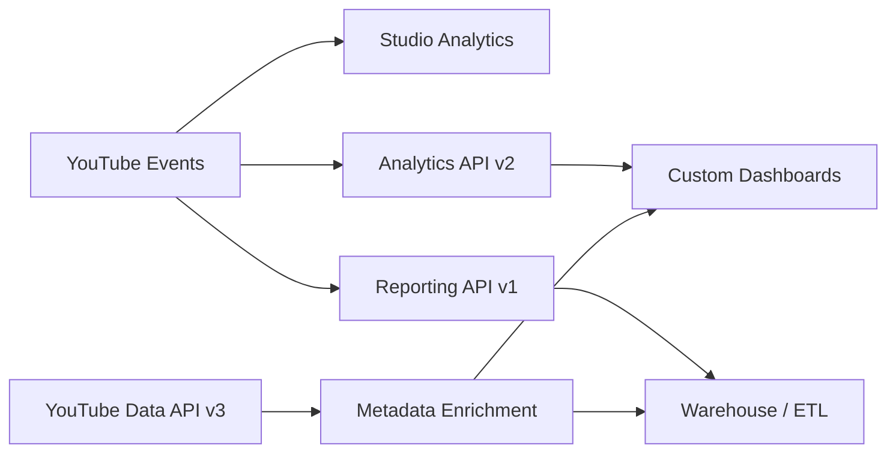
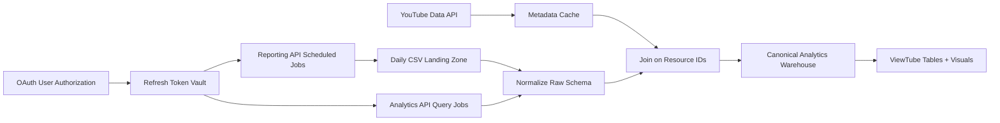

# YouTube Metrics and Dimensions Master Glossary

## Quick-Reference Summary

YouTube analytics is not one database exposed through four interchangeable interfaces. It is an **analytics ecosystem** made of several surfaces with different purposes, schemas, latency, aggregation rules, privacy behavior, and supported fields.

The four surfaces creators and developers most often confuse are:

| Surface | Primary job | Query style | Best for | Important limitation |
|---|---|---|---|---|
| YouTube Studio | Interactive creator analysis | UI-driven | Daily creator decisions, charts, audience insights, retention, Shorts diagnostics | Not every Studio metric has a public API equivalent |
| YouTube Analytics API v2 | Targeted custom reports | Synchronous query | Dashboards, custom analysis, filtered metric/dimension queries | Only documented metric/dimension combinations are valid |
| YouTube Reporting API v1 | Scheduled bulk exports | Asynchronous daily CSV | Warehouses, ETL, long-running channel/content-owner pipelines | Fixed report schemas; no on-demand arbitrary grouping |
| YouTube Data API v3 | Resource metadata and management | Resource requests | Titles, descriptions, thumbnails, playlists, channel/video metadata | Not a substitute for performance analytics |

> **Key distinction:** Google describes the Analytics API as supporting “real-time queries.” That means the request is executed synchronously against the analytics service; it does **not** mean every metric represents live event telemetry with zero processing delay.

### Architecture at a Glance

A reliable ViewTube data system therefore needs to know not only **what a metric means**, but also:

- which surface exposes it;
- which dimensions it can be combined with;
- whether it is core or non-core;
- whether the value is estimated;
- whether privacy thresholds can hide detail;
- whether Shorts, VOD, live, playlists, or Content Owner reports change its meaning;
- whether the same concept has a different field name in another API.

---

## Analytics Surface Architecture

### YouTube Studio

YouTube Studio is the creator-facing analytical workspace. It provides:

- overview and key metric cards;
- Reach, Engagement, Audience, Revenue and Content analysis;
- audience-retention visualizations;
- Shorts-specific reports such as **Shown in feed** and **How many chose to view**;
- new, casual and regular viewer segments;
- Advanced Mode for deeper filtering and comparison.

Studio is a presentation layer, not a raw-schema browser. Some Studio concepts are assembled from internal systems and are not guaranteed to appear as public Analytics API metrics.

### YouTube Analytics API v2

The Analytics API uses:

`GET https://youtubeanalytics.googleapis.com/v2/reports`

The `reports.query` method accepts combinations of:

- metrics;
- dimensions;
- filters;
- sort instructions;
- date ranges;
- channel/content-owner identity.

The API uses mostly **camelCase** names such as:

- `estimatedMinutesWatched`
- `averageViewDuration`
- `averageViewPercentage`
- `subscribersGained`
- `estimatedRevenue`

> **Important:** A metric existing in the metric reference does not mean it can be combined with every dimension. The supported report tables are the authority for valid combinations.

### YouTube Reporting API v1

The Reporting API is designed for scheduled bulk exports.

A client creates a reporting job, then downloads versioned daily CSV files. Reports are generated asynchronously. Google’s guide states that clients can begin retrieving reports within 48 hours of job creation; the REST reference also describes jobs as generating daily reports and notes availability within roughly the first day. Build pipelines to tolerate asynchronous arrival rather than depend on an exact hour.

Reporting fields generally use **snake_case**, for example:

- `watch_time_minutes`
- `average_view_duration_seconds`
- `estimated_partner_revenue`
- `traffic_source_type`

Bulk reports have predefined schemas. You do **not** choose arbitrary dimensions per request.

### YouTube Data API v3

The Data API supplies structural and descriptive YouTube resources.

Typical uses:

- map `video_id` to title and description;
- retrieve thumbnails;
- retrieve channel metadata;
- inspect playlists and playlist items;
- read public statistics;
- manage supported account resources.

A warehouse commonly joins Reporting API rows to Data API resources for human-readable metadata.

> **Data governance:** Google’s Reporting API documentation notes that stored Data API resource metadata must be refreshed or deleted in accordance with YouTube API Services policies. Do not treat copied metadata as permanent static truth.

---

## Surface Capability Matrix

| Capability | Studio | Analytics API v2 | Reporting API v1 | Data API v3 |
|---|---:|---:|---:|---:|
| Interactive creator charts | Yes | No | No | No |
| Custom metric/dimension queries | Limited UI | Yes | No | No |
| Scheduled bulk CSV | No | No | Yes | No |
| Resource metadata | Limited | IDs in reports | IDs in reports | Yes |
| Monetization metrics | Yes if eligible | Yes with monetary scope | Yes with monetary scope/report type | Limited statistics only |
| Retention curve analysis | Yes | Yes for supported retention reports | Not a 1:1 bulk equivalent | No |
| Traffic-source detail | Yes | Yes for supported source types | Yes | No |
| Playlist performance | Yes | Yes | Yes | Playlist metadata only |
| Privacy/anonymization effects | Yes | Yes | Yes | Resource-policy dependent |
| Server-side custom sorting/filtering | UI controls | Yes | Fixed reports / client ETL | Resource query parameters |

---

## Authentication, Authorization and Identity

Analytics and Reporting API access requires OAuth 2.0 user authorization.

### Primary Analytics Scopes

| Scope | Use |
|---|---|
| `yt-analytics.readonly` | Read non-monetary YouTube Analytics reports |
| `yt-analytics-monetary.readonly` | Read monetary and non-monetary analytics reports |
| `youtube` | Manage account resources and Analytics groups where supported |
| `youtube.readonly` | Read YouTube account/resource information |
| `youtubepartner` | Content-owner/partner asset access where applicable |

### Authentication Checklist

- [ ] Create or select a Google Cloud project.
- [ ] Enable the required YouTube APIs.
- [ ] Configure the OAuth consent screen.
- [ ] Create the correct OAuth client type.
- [ ] Request the minimum scopes needed.
- [ ] Store refresh tokens securely for background jobs.
- [ ] Treat access tokens as secrets.
- [ ] Handle revoked authorization and expired credentials.
- [ ] Verify the authenticated Google identity is linked to the intended YouTube channel or Brand Account.

### Service Accounts

> **Important limitation:** The YouTube Data API does not support the OAuth service-account flow for channel-linked user data. Google documents that attempts to use a service account where a linked YouTube identity is required can produce `NoLinkedYouTubeAccount`.

For YouTube channel analytics systems, use user OAuth authorization and securely stored refresh tokens rather than assuming a Cloud service account can impersonate a channel.

---

## Data Timing, Processing and Privacy

### Query Time vs Data Freshness

A synchronous Analytics API response can still contain processed data whose newest values lag behind current activity.

Do not use “real-time query” as a synonym for “zero-latency analytics.”

### Reporting API Windows

Bulk reports:

- represent a defined reporting period;
- are updated daily;
- may arrive asynchronously;
- can include replacement/backfill data;
- have retention windows for downloadable report files.

A warehouse should therefore be **idempotent**: newer files covering the same period can replace earlier ingested versions.

### Pacific-Time Reporting

Reporting API `date` rows use Pacific time boundaries. Depending on daylight saving time, the offset can be UTC-7 or UTC-8, and DST transition days can contain 23 or 25 hours.

> **Analytics trap:** Never assume a YouTube reporting “day” is the same interval as a UTC calendar day.

### Data Anonymization

YouTube can suppress or aggregate dimension values when a row does not meet privacy thresholds.

Examples include:

- country/province details becoming `ZZ` or `US-ZZ`;
- demographic values becoming `NULL`;
- traffic-source detail becoming `NULL`.

> **Do not interpret:** `NULL`, `ZZ`, or missing detailed rows as zero activity.

---

## Dimensions: The Structural Axes of a Report

A **dimension** describes how metrics are grouped.

In a bulk report, each row represents a unique combination of the report’s dimensions. In a query report, the selected dimensions determine the grouping grain.

### Core Structural Mapping

| Concept | Analytics API v2 | Reporting API v1 | Notes |
|---|---|---|---|
| Day | `day` | `date` | Reporting dates use Pacific-time day boundaries |
| Month | `month` | Report-type dependent | Analytics month values use `YYYY-MM` |
| Video | `video` | `video_id` | Video resource ID |
| Channel | `channel` | `channel_id` | Analytics `channel` is primarily a content-owner dimension |
| Playlist | `playlist` | `playlist_id` | Availability depends on report |
| Asset | Content-owner reports | `asset_id` | Content ID asset, not ordinary creator video ID |
| Uploader type | `uploaderType` | `uploader_type` | Content-owner reporting |
| Claimed status | `claimedStatus` | `claimed_status` | Content-owner reporting |

### A Critical Mapping Difference: Content Type

The Analytics API documents `creatorContentType` with values such as:

- `LIVE_STREAM`
- `SHORTS`
- `VIDEO_ON_DEMAND`
- `STORY`
- `UNSPECIFIED`

Do **not** assume that every Analytics API dimension has a Reporting API field with the same concept converted to snake_case. The current Reporting API dimension reference does not document a general `creator_content_type` dimension.

---

## Geographic Dimensions

| Analytics API | Reporting API | Meaning | Constraint |
|---|---|---|---|
| `country` | `country_code` | Two-letter ISO 3166-1 country code | `ZZ` can represent unresolved/anonymized geography |
| `province` | `province_code` | U.S. state / DC ISO 3166-2 code | Analytics queries require `country==US` |
| `dma` | Report-type dependent | Nielsen U.S. Designated Market Area | U.S.-specific |
| `city` | No universal 1:1 bulk field | Estimated city | Analytics data available from 2022-01-01 |
| `continent` | — | Filter-only UN statistical region | Analytics filter |
| `subContinent` | — | Filter-only UN subregion | Analytics filter |

### Geography Checklist

- [ ] Confirm the report actually supports the geographic dimension.
- [ ] Apply `country==US` when using `province`.
- [ ] Treat privacy-suppressed rows as missing detail, not zero.
- [ ] Keep geographic codes separate from display names.
- [ ] Do not rename `province` to “state” inside the canonical API schema; translate only at the presentation layer.

---

## Traffic Sources

Traffic source reporting is one of the clearest examples of **same concept, different schema**.

The Analytics API uses the symbolic `insightTrafficSourceType` dimension. The Reporting API uses numeric `traffic_source_type` values.

### Reporting API Traffic-Source Reference

| Reporting value | Meaning | Query-report equivalent / concept |
|---:|---|---|
| 0 | Direct or unknown | `NO_LINK_OTHER` / `UNKNOWN_MOBILE_OR_DIRECT` |
| 1 | YouTube advertising | `ADVERTISING` |
| 3 | Browse features | Historically represented in query reports as `SUBSCRIBER` for this source family |
| 4 | YouTube channels | `YT_CHANNEL` |
| 5 | YouTube Search | `YT_SEARCH` |
| 7 | Suggested videos | `RELATED_VIDEO` / `YT_RELATED` |
| 8 | Other YouTube features | `YT_OTHER_PAGE` |
| 9 | External | `EXT_URL` |
| 11 | Cards / annotations | `ANNOTATION` |
| 14 | Playlist playback | `PLAYLIST` |
| 17 | Notifications | `NOTIFICATION` |
| 18 | Playlist pages | `YT_PLAYLIST_PAGE` |
| 19 | Programming from claimed content | `CAMPAIGN_CARD` |
| 20 | End screens | `END_SCREEN` |
| 23 | Stories | Stories swipe source |
| 24 | Shorts | Shorts vertical-swipe source |
| 25 | Product Pages | Product page referral |
| 26 | Hashtag Pages | Hashtag referral |
| 27 | Sound Pages | Shorts sound-page referral |
| 28 | Live redirect | Live Redirect |
| 29 | Podcasts | YouTube Podcasts page |
| 30 | Remixed video | Remix link in Shorts player |
| 31 | Vertical live feed | Vertical live source |
| 32 | Related video | Related-video link in Shorts player |

### Traffic-Source Detail

`traffic_source_detail` can contain different identifiers depending on source:

- search term;
- referring video ID;
- channel ID;
- external URL/domain;
- notification type;
- hashtag;
- product ID;
- other source-specific detail.

> **Privacy warning:** Traffic-source detail is one of the fields that can be anonymized when row thresholds are not met.

---

## Playback Location, Device and Platform Dimensions

### Playback Location

Reporting API `playback_location_type` includes numeric categories for:

- official YouTube watch/app playback;
- embedded playback;
- channel-page playback;
- unclassified;
- browse features;
- Search;
- Shorts Feed.

Analytics API uses `insightPlaybackLocationType` and report-specific values.

Do not join the raw enumerations across APIs without a mapping layer.

### Device Type

Analytics API `deviceType` uses symbolic values such as:

- `DESKTOP`
- `TV`
- `MOBILE`
- `TABLET`
- `GAME_CONSOLE`
- `UNKNOWN`

Reporting API `device_type` uses numeric identifiers such as:

| Value | Device |
|---:|---|
| 100 | Unknown |
| 101 | Computer |
| 102 | TV |
| 103 | Game console |
| 104 | Mobile phone |
| 105 | Tablet |

### Operating System

The two APIs also use different operating-system enumerations. Reporting bulk files use numeric codes; Analytics query reports expose symbolic API values.

> **Data-model recommendation:** Store the raw source code/value and a normalized ViewTube display category. Never discard the raw value.

---

## Demographic Dimensions

### Age Group

Analytics API values include:

- `age13-17`
- `age18-24`
- `age25-34`
- `age35-44`
- `age45-54`
- `age55-64`
- `age65-`

Reporting API uses corresponding uppercase codes such as `AGE_18_24`.

### Gender

Analytics API:

- `female`
- `male`
- `user_specified`

Reporting API:

- `FEMALE`
- `MALE`
- `GENDER_OTHER`

Demographic reporting can be privacy-limited.

---

## Core Metrics Registry

A **metric** is a measured value: count, duration, ratio, percentage, or money.

### Core Analytics API Metrics

Google currently marks these among the Analytics API’s core metrics:

- `averageViewDuration`
- `comments`
- `dislikes`
- `engagedViews`
- `estimatedMinutesWatched`
- `estimatedRevenue`
- `likes`
- `shares`
- `subscribersGained`
- `subscribersLost`
- `viewerPercentage`
- `views`

Core status matters because core metrics receive stronger deprecation-policy protection than non-core fields.

---

## Views, Reach and Impressions

| Concept | Analytics API | Reporting API | Unit | Important note |
|---|---|---|---|---|
| Views | `views` | `views` | Count | Definition can depend on report/content format |
| Engaged views | `engagedViews` | `engaged_views` | Count | Core metric |
| Premium views | `redViews` | `red_views` | Count | “Red” remains in legacy field names although product is YouTube Premium |
| Thumbnail impressions | Availability depends on supported report | `video_thumbnail_impressions` | Count | Impression requires >1 second and at least 50% thumbnail visibility |
| Thumbnail CTR | Overview mapping uses `videoThumbnailImpressionsClickRate` | `video_thumbnail_impressions_ctr` | Percentage | Clicks divided by counted impressions |

> **Naming correction:** Do not use `videoThumbnailImpressionsClickThroughRate` as the canonical Analytics API field name. Google’s cross-API mapping documents `videoThumbnailImpressionsClickRate`.

### Impressions Are Not All Exposures

Thumbnail impressions are only counted on eligible YouTube surfaces under YouTube’s impression rules. A view can therefore exist without a counted thumbnail impression.

That means:

`views ÷ thumbnail impressions`

is **not** a universal “conversion rate for all traffic.”

---

## Watch Time and Retention Metrics

| Analytics API | Reporting API | Unit | Meaning |
|---|---|---|---|
| `estimatedMinutesWatched` | `watch_time_minutes` | Minutes | Aggregate watch time |
| `averageViewDuration` | `average_view_duration_seconds` | Seconds | Average playback duration |
| `averageViewPercentage` | `average_view_duration_percentage` | Percent | Average percentage watched |
| `estimatedRedMinutesWatched` | `red_watch_time_minutes` | Minutes | Premium-member watch time |

### Granular Audience Retention

The Analytics API supports specialized retention reports using:

- `elapsedVideoTimeRatio`
- `audienceWatchRatio`
- `relativeRetentionPerformance`
- `startedWatching`
- `stoppedWatching`
- `totalSegmentImpressions`

These are **specialized query-report metrics**.

> **Schema warning:** Do not invent snake_case Reporting API equivalents such as `started_watching` or `total_segment_impressions` unless the Reporting API explicitly documents them. The current Reporting metric reference does not list those as bulk fields.

### What the Segment Metrics Actually Mean

`startedWatching` is not simply “number of viewers present at this timestamp.” It counts how often a segment was the **first segment seen** in a playback.

`stoppedWatching` counts how often a segment was the **last segment seen**.

`totalSegmentImpressions` counts how often that segment was viewed and can exceed the number of viewers because the same viewer can see a segment more than once.

---

## Engagement Metrics

| Metric | Meaning |
|---|---|
| `likes` | Positive ratings recorded for the content |
| `dislikes` | Negative ratings available to the authenticated owner/report |
| `comments` | Comments associated with supported report scope |
| `shares` | Shares initiated through YouTube’s Share mechanism |
| `subscribersGained` | Subscription events attributed under report rules |
| `subscribersLost` | Unsubscription events attributed under report rules |
| `videosAddedToPlaylists` | Video-added-to-playlist events |
| `videosRemovedFromPlaylists` | Video-removed-from-playlist events |

> **Scope trap:** When subscriber metrics are filtered to a particular video, the API attribution rules are narrower than channel-level subscriber totals. Do not assume every subscription event can be assigned to a specific video.

---

## Shorts Metrics and the 2025–2026 View Definition Shift

Beginning March 31, 2025, YouTube changed Shorts view counting so a Shorts view counts when the Short starts to play or replay, without a minimum watch-time requirement. The older Shorts methodology remains available as **engaged views**.

By August 2026, YouTube documented the broader view-counting update across Shorts, VOD and live playback in Studio Content Manager documentation.

### Shorts Studio Metrics

Two important Studio concepts are:

**Shown in feed**  
The number of times a Short was shown in the Shorts Feed.

**How many chose to view**  
The percentage of those opportunities where viewers viewed rather than swiped away.

These are valuable Studio diagnostics, but do not assume they map to public Analytics/Reporting API fields named `shownInFeed` or `viewedVsSwipedAway`.

### No Universal Shorts Benchmark

The supplied research included values such as:

- 70% chose to view;
- 90% APV;
- 130% APV for 15-second loops.

Those may appear in creator-industry advice, but they are **not official universal YouTube thresholds**.

Use them, if at all, as creator-specific historical comparison points—not platform rules.

### Shorts Diagnostic Questions

- [ ] Was the Short actually shown in the Shorts Feed?
- [ ] How often did viewers choose to view rather than swipe?
- [ ] What were AVD and APV?
- [ ] Did loops/rewatches affect APV?
- [ ] Which traffic sources supplied the views?
- [ ] Did subscribers or returning viewers behave differently?
- [ ] Is the comparison against Shorts of similar length and audience?
- [ ] Did the view-definition change affect the historical comparison window?

---

## Audience Metrics and Viewer Cohorts

### Studio Audience Segments

YouTube Studio currently defines:

**New viewers**  
Viewers who watched the channel for the first time in the selected period, with additional rules for private browsing, deleted history, and long absence.

**Casual viewers**  
Viewers who watched at least once per month for one to five months in the past year.

**Regular viewers**  
Viewers who watched at least once per month for more than six months in the past year.

**Returning viewers**  
Viewers who previously watched the channel and returned during the selected period.

**Monthly audience**  
A rolling 28-day active-audience view.

### API Availability Warning

> **Do not assume:** New, casual and regular viewers are standard public Analytics API metrics merely because they appear in Studio.

The public Analytics API metric reference should be treated as the authority for programmatic availability.

### Subscribers Are Not Active Audience

Subscriber count records subscription state. It does not establish that those people are currently watching.

For active audience analysis, Studio’s monthly audience and unique-viewer concepts are more appropriate.

---

## Revenue and Ad Performance Metrics

Monetary fields require the monetary analytics scope and channel eligibility.

### Canonical Mapping

| Studio concept | Analytics API v2 | Reporting API v1 | Meaning |
|---|---|---|---|
| Estimated revenue | `estimatedRevenue` | `estimated_partner_revenue` | Estimated net partner revenue across supported sources |
| Estimated ad revenue | `estimatedAdRevenue` | `estimated_partner_ad_revenue` | Estimated net Google-sold ad revenue |
| Gross revenue | `grossRevenue` | `estimated_youtube_ad_revenue` | Estimated gross ad revenue before partner share |
| CPM | `cpm` | `estimated_cpm` | Estimated gross revenue per 1,000 ad impressions |
| Monetized playbacks | `monetizedPlaybacks` | `estimated_monetized_playbacks` | Playbacks with at least one ad impression |
| Playback-based CPM | `playbackBasedCpm` | `estimated_playback_based_cpm` | Estimated gross revenue per 1,000 monetized playbacks |

> **Naming correction:** Reporting API financial names are not simple snake_case conversions of the Analytics API names.

### Revenue Caveats

Estimated revenue:

- can be adjusted at month end;
- does not necessarily include partner-sold/partner-served advertising;
- can vary by geography, inventory, content format and advertiser demand;
- should not be inferred directly from CPM alone.

### Revenue Diagnostic Grid

| Pattern | What it can mean | What to inspect next |
|---|---|---|
| Views up, revenue flat | More non-monetized or lower-value viewing | Format, geography, monetized playbacks, revenue source |
| CPM up, revenue down | Higher advertiser price but fewer monetized opportunities | Monetized playbacks, ad impressions, view mix |
| Revenue up faster than views | Higher monetization density, geography mix or advertiser demand | CPM, playback CPM, monetized playbacks |
| Shorts views surge, RPM mix changes | Format mix changed | Separate Shorts and long-form revenue analysis |

> **Do not prescribe:** Adding more mid-rolls is not automatically the correct response to a revenue change. Creator experience, retention, eligibility and ad-suitability constraints matter.

---

## Playlist Metrics

Playlist analytics contains two different ideas:

1. activity **inside** a playlist context;
2. interactions with the playlist object itself.

Useful fields include:

- `playlistStarts` / `playlist_starts`;
- playlist views;
- playlist saves added/removed;
- average time in playlist where supported;
- video metrics measured specifically in playlist context.

> **Important:** A video’s ordinary channel views and its views while played inside a playlist are not interchangeable scopes.

---

## Live Metrics

YouTube supports live-specific reporting such as:

- average concurrent viewers;
- peak concurrent viewers;
- livestream position;
- live/on-demand dimensions;
- watch-time and view metrics filtered to live activity.

### Live Analysis Checklist

- [ ] Separate live playback from replay/VOD behavior.
- [ ] Use concurrent-viewer metrics only in supported live reports.
- [ ] Keep the stream’s event-time axis distinct from ordinary calendar aggregation.
- [ ] Compare similar stream lengths and formats.
- [ ] Do not mix concurrent viewers with total views.

---

## Cross-API Naming Map

| Concept | Analytics API | Reporting API |
|---|---|---|
| Day | `day` | `date` |
| Video | `video` | `video_id` |
| Country | `country` | `country_code` |
| Province | `province` | `province_code` |
| Device | `deviceType` | `device_type` |
| OS | `operatingSystem` | `operating_system` |
| Traffic source | `insightTrafficSourceType` | `traffic_source_type` |
| Views | `views` | `views` |
| Engaged views | `engagedViews` | `engaged_views` |
| Watch time | `estimatedMinutesWatched` | `watch_time_minutes` |
| Avg view duration | `averageViewDuration` | `average_view_duration_seconds` |
| Avg % viewed | `averageViewPercentage` | `average_view_duration_percentage` |
| Subscribers gained | `subscribersGained` | `subscribers_gained` |
| Subscribers lost | `subscribersLost` | `subscribers_lost` |
| Est. revenue | `estimatedRevenue` | `estimated_partner_revenue` |
| Est. ad revenue | `estimatedAdRevenue` | `estimated_partner_ad_revenue` |
| Gross revenue | `grossRevenue` | `estimated_youtube_ad_revenue` |
| CPM | `cpm` | `estimated_cpm` |
| Monetized playbacks | `monetizedPlaybacks` | `estimated_monetized_playbacks` |
| Playback CPM | `playbackBasedCpm` | `estimated_playback_based_cpm` |

---

## Format Applicability

Not every metric is meaningful on every format.

| Concept | Long-form VOD | Shorts | Live | Playlist context |
|---|---|---|---|---|
| `views` | Yes | Yes; definition changed in 2025 | Yes | Can be scoped to playlist reports |
| `engagedViews` | Supported in API reports | Especially important after Shorts view change | Supported where report allows | Report-dependent |
| Thumbnail impressions | Common | Shorts Feed uses different exposure UX | Can apply to eligible surfaces | Not a universal playlist metric |
| Shown in feed | No | Studio Shorts metric | No | No |
| How many chose to view | No | Studio Shorts metric | No | No |
| AVD / APV | Yes | Yes | Yes in supported reports | Supported in some playlist contexts |
| Concurrent viewers | No | No | Live only | No |
| Playlist starts | No | No | No | Playlist-specific |
| CPM / playback CPM | Monetized reports | Monetization model differs | Monetized reports | Not a playlist performance default |

> **Comparison rule:** “Available” does not mean “directly comparable.”

---

## Analytical Compatibility Checklist

Before comparing two values, verify:

- [ ] Same metric definition.
- [ ] Same API/UI surface.
- [ ] Same content format.
- [ ] Same date/lifecycle window.
- [ ] Same timezone boundary.
- [ ] Same dimensions and filters.
- [ ] Same monetary currency.
- [ ] Same privacy/anonymization conditions.
- [ ] Same view-definition era.
- [ ] Same report scope: channel, video, playlist, content owner or live.

---

## Developer Pipeline Blueprint

### Pipeline Checklist

- [ ] Enable required APIs.
- [ ] Authorize with the correct user identity.
- [ ] Store refresh tokens securely.
- [ ] Preserve raw source field names.
- [ ] Preserve raw enumeration values.
- [ ] Add a normalization layer instead of renaming source data in place.
- [ ] Track report type and version.
- [ ] Track ingestion timestamp.
- [ ] Make backfill imports idempotent.
- [ ] Refresh Data API metadata according to policy.
- [ ] Store timezone and currency context.
- [ ] Represent suppressed/missing values separately from zero.
- [ ] Record the API revision date used by the mapping.

---

## Studio vs API Discrepancies

Studio and APIs can differ without either being “wrong.”

Possible reasons include:

- different processing windows;
- fixed Studio cards vs custom API filters;
- privacy thresholds;
- data revisions;
- timezone boundaries;
- metric-definition changes;
- Studio-only metrics;
- currency handling;
- different selected scopes;
- partial current-day data.

### Discrepancy Triage

1. Confirm the exact metric name.
2. Confirm the date range.
3. Confirm the timezone boundary.
4. Confirm content type.
5. Confirm filters.
6. Confirm whether Studio is showing a rolling metric.
7. Confirm whether API data is privacy-limited.
8. Check the API revision history.
9. Re-run only after matching scope and definition.

---

## Common Myths and Schema Errors

### Myth: “Every Studio metric has an API field”

False. Studio can expose product-level insights that are not part of the public API schema.

### Myth: “Reporting API is Analytics API with snake_case names”

False. Many fields map cleanly, but others have different names, different availability, fixed report schemas, or no direct equivalent.

### Myth: “Missing equals zero”

False. Privacy thresholds, unsupported combinations, processing delays and absent report rows can all produce missingness.

### Myth: “CPM is creator revenue per 1,000 views”

False. CPM is an advertiser-side ad-impression measure. It is not RPM.

### Myth: “A universal Shorts threshold tells you if the algorithm will scale a video”

Unsupported. Studio exposes viewer-response metrics, but YouTube does not publish universal 70%/90%/130% distribution gates.

### Myth: “Service accounts are the cleanest way to read a creator’s YouTube channel”

Not for channel-linked YouTube user data. YouTube’s API authentication guidance requires user-linked OAuth flows.

---

## What to Do With This Information

### If You Are a Creator

Use this glossary to understand what a Studio metric actually measures before changing content strategy.

### If You Are an Analyst

Treat metric + dimension + filters + time window + format as one analytical object. A number without those qualifiers is incomplete.

### If You Are a Developer

Build a canonical semantic layer above the source APIs rather than pretending the source schemas are identical.

### If You Are Building ViewTube

The application should:

- preserve canonical API field names;
- show creator-friendly labels separately;
- retain source provenance;
- expose missingness and privacy suppression;
- prevent invalid metric/dimension combinations;
- preserve dataset window and timezone identity;
- distinguish Studio-only metrics;
- distinguish Shorts, VOD and live definitions;
- maintain versioned field mappings;
- keep monetary and non-monetary authorization requirements explicit.

---

## Quick Diagnostic Reference

| Question | First thing to verify |
|---|---|
| Studio and API values differ | Same scope, date window, definition and processing state? |
| State data missing | Did the Analytics query include `country==US` with `province`? |
| Search terms missing | Could privacy anonymization have suppressed `traffic_source_detail`? |
| Shorts views jump after 2025 | Are you crossing the March 31, 2025 view-definition change? |
| Revenue differs after month close | Was estimated revenue adjusted? |
| API query fails | Is the metric/dimension combination supported by that specific report? |
| Service account fails | Use channel-linked user OAuth instead |
| APV unavailable with another dimension | Check the report compatibility table; not all combinations are supported |
| Reporting field not found | Verify exact documented snake_case name rather than guessing |
| Studio metric has no API result | It may be Studio-only |

---

## Glossary

**Analytics API** — Query-based YouTube performance API using `reports.query`.

**Reporting API** — Bulk-report API that produces scheduled CSV exports.

**Data API** — YouTube resource API for videos, channels, playlists, comments and metadata.

**Metric** — Quantitative measurement such as views, watch time or revenue.

**Dimension** — Attribute used to group metrics, such as day, country or traffic source.

**Filter** — Constraint applied to a report without necessarily grouping by that field.

**Core metric/dimension** — Field explicitly covered by YouTube’s API deprecation policy protections.

**Non-core field** — Supported field without the same core deprecation guarantees.

**Engaged view** — Core metric counting viewing past the first frame or an explicit click/tap to play under YouTube’s documented definition.

**Thumbnail impression** — Eligible thumbnail display meeting YouTube’s visibility/time criteria.

**AVD** — Average View Duration.

**APV** — Average View Percentage.

**Monetized playback** — Playback in which at least one ad impression is shown.

**CPM** — Estimated gross ad revenue per 1,000 ad impressions.

**Playback-based CPM** — Estimated gross ad revenue per 1,000 monetized playbacks.

**Privacy threshold** — Minimum reporting condition below which detailed dimension values can be anonymized.

**Backfill** — Later report data that can replace previously delivered data for the same period.

**Studio-only metric** — Creator-facing measure documented in Studio but not necessarily available as a public API field.

**Raw schema** — Field names and enumeration values exactly as supplied by the source API.

**Canonical semantic layer** — ViewTube’s normalized interpretation above raw API schemas.

---

## Related ViewTube Resources

| Resource | Connection |
|---|---|
| How YouTube Recommendations and Discovery Work | Separates creator-facing analytics signals from internal recommender assumptions |
| Shorts vs Long-Form | Explains why format-specific metrics should not be compared mechanically |
| Traffic Sources and Discovery Pathways | Deep reference for traffic-source dimensions and interpretation |
| Audience Retention and Watch Behavior | Expands the retention metrics defined here |
| YouTube Revenue and Monetization Fundamentals | Expands monetary metrics and revenue mechanics |
| Reading Analytics Correctly | Covers windows, scope, missingness, causal errors and statistical traps |

---

## Sources and Further Reading

### Official Google / YouTube Sources

**[S1] YouTube Analytics API — Metrics**  
https://developers.google.com/youtube/analytics/metrics

**[S2] YouTube Analytics API — Dimensions**  
https://developers.google.com/youtube/analytics/dimensions

**[S3] YouTube Analytics API — Channel Reports**  
https://developers.google.com/youtube/analytics/channel_reports

**[S4] YouTube Analytics API — reports.query**  
https://developers.google.com/youtube/analytics/reference/reports/query

**[S5] YouTube Analytics & Reporting APIs — Introduction / cross-API mappings**  
https://developers.google.com/youtube/reporting

**[S6] YouTube Reporting API — Metrics**  
https://developers.google.com/youtube/reporting/v1/reports/metrics

**[S7] YouTube Reporting API — Dimensions**  
https://developers.google.com/youtube/reporting/v1/reports/dimensions

**[S8] YouTube Reporting API — Bulk Reports Guide**  
https://developers.google.com/youtube/reporting/v1/reports

**[S9] YouTube Analytics & Reporting API — Authorization**  
https://developers.google.com/youtube/reporting/guides/authorization

**[S10] YouTube Analytics & Reporting APIs — Revision History**  
https://developers.google.com/youtube/reporting/revision_history

**[S11] YouTube Data API v3 — Reference**  
https://developers.google.com/youtube/v3/docs

**[S12] YouTube Data API — OAuth 2.0 Authorization**  
https://developers.google.com/youtube/v3/guides/authentication

**[S13] YouTube Help — New, Casual and Regular Viewers**  
https://support.google.com/youtube/answer/13615784

**[S14] YouTube Help — Shorts Analytics Content Tab**  
https://support.google.com/youtube/answer/12942217

**[S15] TeamYouTube — Change to Shorts View Counting, March 31 2025**  
https://support.google.com/youtube/thread/333869549

### Secondary Sources

Secondary implementation articles can be useful for architecture examples, but they should not override the Google developer documentation for field names, scopes, report compatibility, or metric definitions.

---

## Document Maintenance

| Attribute | Value |
|---|---|
| Document version | 1.0 |
| Research completed | 2026-09-26 |
| Official API references checked | 2026-09-26 |
| Recommended review | Quarterly |
| High-change areas | Shorts definitions, API revision history, monetization fields, new Studio audience metrics, traffic-source enumerations |
| Canonical authority | Official Google Developers / YouTube Help documentation |

### Maintenance Checklist

- [ ] Review the Analytics API metrics page.
- [ ] Review the Analytics API dimensions page.
- [ ] Review Reporting API metrics and dimensions.
- [ ] Read the Reporting/Analytics revision history.
- [ ] Check for new or deprecated core fields.
- [ ] Verify Shorts view and engaged-view definitions.
- [ ] Verify Studio-only audience/Shorts metrics.
- [ ] Verify traffic-source numeric enumerations.
- [ ] Verify monetization field mappings.
- [ ] Record any schema change in the ViewTube analytics canon.
