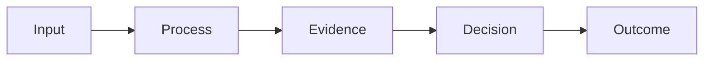
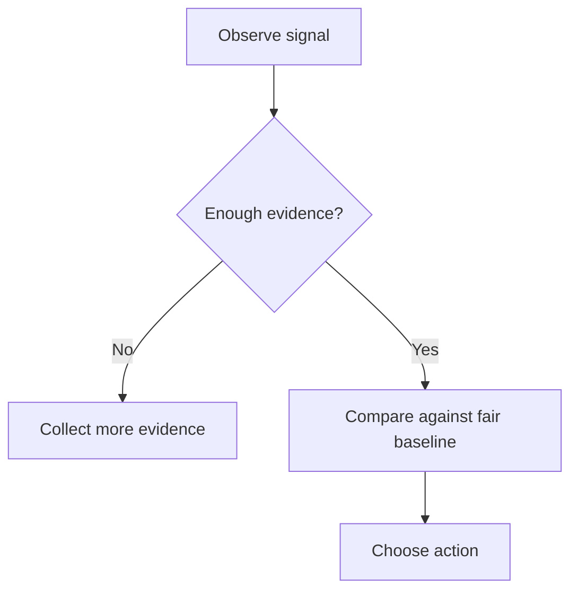

# Resource Title

## Quick-Reference Summary

Open with a concise explanation of the subject, why it matters, and the most important caveat.

> **Key distinction:** Put the highest-value conceptual distinction here.

### At a Glance

| Concept | What it means | Why it matters |
|---|---|---|
| Concept A | Concise definition | Creator implication |
| Concept B | Concise definition | Creator implication |
| Concept C | Concise definition | Creator implication |

### System / Process Flow

---

## Core Concept

Explain one major subject per `##` section. The ViewTube Resource Document renderer treats major sections as **SubToolboxes**.

### Definition Module

Short explanatory prose.

### Evidence Grid

| Claim | Evidence level | Source | Limitation |
|---|---|---|---|
| ... | Official / Strong / Inference / Observation / Unknown | ... | ... |

> **Important limitation:** Make uncertainty visible rather than burying it in prose.

---

## Comparison Section

| Dimension | Option A | Option B | Important difference |
|---|---|---|---|
| ... | ... | ... | ... |

### Creator Takeaway

Explain what the comparison changes in practice.

---

## Decision Framework

| Situation | Evidence to inspect | What not to assume | Sensible next action |
|---|---|---|---|
| ... | ... | ... | ... |

---

## Worked Example

> **Illustrative example — not real YouTube data or an official benchmark.**

Walk through the reasoning step by step.

---

## Creator Action Toolbox

### Before You Start

- [ ] Confirm the goal.
- [ ] Confirm the relevant audience.
- [ ] Identify the evidence needed.

### During Review

- [ ] Compare like-for-like cases.
- [ ] Record assumptions.
- [ ] Distinguish fact from inference.

### After Action

- [ ] Record what changed.
- [ ] Set a review window.
- [ ] Recheck before promoting the result into durable learning.

---

## Common Misinterpretations

### Misinterpretation 1

**Common conclusion:** ...

**What the evidence actually supports:** ...

**What else to check:** ...

---

## Myths vs Evidence

### Myth

State the real, common claim.

### What the Evidence Says

Explain the strongest available evidence.

### Practical Interpretation

State the creator-facing lesson without overstating certainty.

---

## What to Do With This Information

### Monitor

- ...

### Compare

- ...

### Test

- ...

### Ignore

- ...

### Document

- ...

---

## Quick Reference

| Question | Best first answer |
|---|---|
| ... | ... |
| ... | ... |

---

## Glossary

**Term** — Concise, technically correct creator-facing definition.

---

## Related ViewTube Resources

| Resource | Why read it next |
|---|---|
| Resource A | ... |
| Resource B | ... |

---

## Sources and Further Reading

### Official YouTube / Google Sources

**[S1] Source title** — Publisher, date. What it supports.  
https://example.com

### Research / Academic Sources

**[S2] Source title** — Authors, date. What it supports.  
https://example.com

### Other High-Quality Sources

### Historical / Superseded Sources

---

## Document Maintenance

| Attribute | Value |
|---|---|
| Document version | 1.0 |
| Research completed | YYYY-MM-DD |
| Review cadence | Semi-annual / annual / event-driven |
| Primary source checks | Official pages to revisit |

### Areas Most Likely to Change

- ...

### Maintenance Checklist

- [ ] Recheck official sources.
- [ ] Review renamed/deprecated metrics or features.
- [ ] Reclassify evidence if stronger primary sources appear.
- [ ] Update related resources and ViewTube tool links.
